# Master read

DE first: [CLAIMS](../03_operations/CLAIMS.md) → [azure](../03_operations/azure/README.md)
→ [databricks](../03_operations/databricks/README.md) → [11 Agent steps](../03_operations/orchestration/main/README.md)
→ two marts. Copilot/AIOS only after that.

Databricks jobs in git are **reconstructed** from Bronze (ADR-013). Tenant admin
is **PIM**, not a daily Global Admin login. SCM-Dev snapshot: **Contributor**.

Sơ đồ này đã được vẽ lại sau vòng audit hiện tại: Plane 1 là implementation có
trong repo; Plane 2 là operational stream liền kề, không được trình bày như code
đang chạy trong repo.

## Bản đồ trách nhiệm upstream → downstream

| Pha | Bài toán | Aric trực tiếp xây/vận hành | Đầu ra cho người dùng | Trạng thái trình bày |
|---|---|---|---|---|
| Foundation | Nguồn SCM phân mảnh, nhiều nền tảng | Source mapping, Azure/Databricks/Fabric architecture, migration decisions | Nền tảng dữ liệu thống nhất | Verified / historical context |
| Data platform & DataOps | Load phải lặp lại, quan sát được, fail-closed | ETL wrappers, SQL projects, manifests, DQ gates, audit, lineage | Dataset đáng tin cho DA/ops | Implemented; evidence-linked |
| SCM products | Cần quyết định forecast và inventory theo đúng grain | Silver conformance, Gold marts, join/grain contracts, publish semantics | Forecast Accuracy, Inventory Health | Selected products; live status per case |
| Analytics enablement | DA cần self-service nhưng không phá metric | Semantic model, measures, access hand-offs, report-ready surfaces | Reports và phân tích SCM | Production-facing / access gates explicit |
| Copilot & automation | Hỏi và hành động trên metric có kiểm soát | Context, deterministic query path, evidence envelope, Agent Flows, approval gate | Copilot/automation cho workflow SCM | Bounded in-use; draft features labelled |
| AIOS | Tái sử dụng pattern thành AI-enabled workbench | Requirements, architecture, safety boundary, evaluation, review | Dev-team MVP và high-level testing | MVP; không phải identity DE chính |

## Cách đọc phần còn lại

- Muốn hiểu con người và title: [profile](01_profile.md), [resume bridge](15_resume_bridge.md).
- Muốn phỏng vấn kỹ thuật: [platform map](03_platform_map.md), [technology decisions](10_technology_decisions.md), [DataOps](12_operations_and_dataops.md).
- Muốn kiểm tra bằng chứng: [evidence matrix](06_evidence_matrix.md) rồi mở source canonical.
- Muốn xem kết quả scan mới nhất: [current repository audit](21_current_repo_audit.md).
- Muốn xem AI mà không biến câu chuyện thành “AI-first”: [AI enablement](05_ai_enablement.md) và [AIOS positioning](../06_enterprise_control_tower/AIOS-Workspace/docs/portfolio/01_data-first-positioning.md).

Các sơ đồ trong trang này là bản vẽ lại cho showcase, dùng tên khái niệm và
không chứa ID, SQL hoặc dữ liệu nội bộ. Bản kỹ thuật gốc được giữ nguyên và
được phân loại trong [diagram catalog](14_diagram_catalog.md).
