# DE platform detail: Azure → Databricks → Fabric

Đây là phần cần đọc khi phỏng vấn Data Engineering. Fabric chỉ là lớp serving
về sau; năng lực cốt lõi bắt đầu từ việc quản lý platform, ingestion và compute
trước khi dữ liệu tới warehouse/semantic layer.



## Luồng kỹ thuật

```text
Azure identity / network / storage / monitoring
        ↓
Enterprise source systems and landing contracts
        ↓
Databricks Spark jobs on the two-mart slice (DateRange / CDC; jobs EXIT)
        ↓
Fabric source/Bronze → Processing/Silver → Gold serving
        ↓
Semantic models → reports → governed Copilot experiences
```

## Những gì tôi thực sự làm ở lớp DE/platform

| Lớp | Trách nhiệm đã đảm nhiệm | Bằng chứng trong repo | Cách nói an toàn |
|---|---|---|---|
| Azure control plane | Đăng ký Entra, subscription, ADLS, Azure Databricks workspace, SQL/Agent, Fabric capacity. PIM Global Admin / Fabric Administrator khi cần; daily = group + workspace RBAC | [azure ops](../03_operations/azure/README.md), live 2026-06-21, AGENTS 2026-08-12 | PIM-eligible tenant admin; không sống Global Admin; Contributor ≠ Workspace Admin |
| Azure SQL / Agent | Agent host 11 wrapper; landing SSMS ≠ Gold Fabric | [sql.md](../03_operations/azure/sql.md) | Không gọi Source_Data 636 bảng là mart SCM |
| Databricks | Bảy job Spark trên **slice hai mart**. Cụm **tắt**. JSON + notebook trong `03_operations/databricks/` là **[Reconstructed]** từ Bronze. CI = `validate_upstream_slice.py`; CD job **không** có trong git. Catalog verified = `edw_dev` | [databricks ops](../03_operations/databricks/README.md), [CI/CD + promote](../03_operations/databricks/cicd_and_promotion.md), ADR-013 | Không nhận dump API; không nhận Spark 24/7; không nhận `edw_prod`; không nhận một pipeline Azure deploy cả SQL lẫn Spark |
| Operational stream (adjacent) | Cùng khóa SKU/kho/transfer/cube/PO với mặt phẳng OT. Không pipeline Gold→Flink trong repo. Không VPS, không DBU 24/7 | ADR-012; `v_HoldingTransferSnapshotDaily.TransferCube`; `ATPWeekEnding`; Logility/PO shortcuts | Owner-confirmed pattern; MSK `[Need-verify]`; không nhận own Flink |
| Fabric data platform | Chuyển dữ liệu đã curated vào source/Bronze, Silver/Processing, Gold/serving; chuẩn hóa SQL project và runtime | `02_marts/`, `03_operations/`, current runtime architecture | Đây là phần cuối của chuỗi DE, không phải toàn bộ vai trò |
| DataOps | Metadata-driven load, dependency waves, DQ/publish gate, audit, lineage, dry-run và release verification | `03_operations/`, `05_tools/`, DQ contracts | Nêu rõ local/live evidence theo evidence matrix |

## Azure responsibility boundary

Portal work is real. Directory titles still split: **PIM Global Admin /
Fabric Administrator** (owner-confirmed, elevate-then-revert) versus
**Contributor on SCM-Dev** (verified 2026-08-12). An Entra export replaces
the owner-confirmed half; it does not erase the workspace snapshot.

## Drill-down canonical files

- [Ashley end-to-end architecture](../01_docs/architecture/ashley/README.md)
- [Azure ops](../03_operations/azure/README.md) · [Databricks ops](../03_operations/databricks/README.md)
- [ADR-013](../01_docs/decisions/ADR-013-upstream-operating-slice.md)
- [Current Fabric runtime](../01_docs/architecture/current/final_enterprise_etl_runtime_architecture.md)
- [Four cadences](../01_docs/architecture/four_cadence_operating_model.md) — OT pattern only
- [Enterprise migration plan](../01_docs/Enterprise_Framework_Migration_Master_Plan.md)
- [DataOps ownership](12_operations_and_dataops.md)
- [Evidence matrix](06_evidence_matrix.md)
