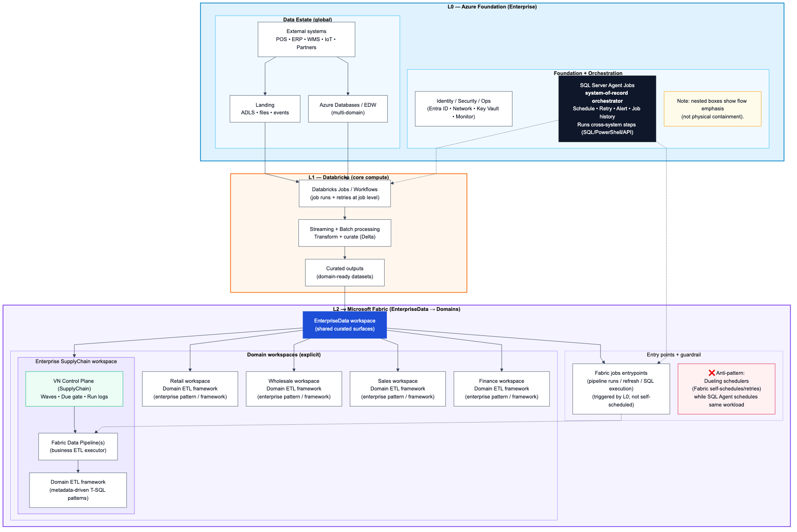

# Ashley enterprise architecture (end-to-end)

Canonical goal: capture the **end-to-end operating model** (infrastructure + orchestration patterns + responsibility boundaries) so VN domain implementation aligns with US enterprise orchestration.

## Overview (recommended)

## Scheduling patterns (anti-pattern vs preferred)

## Deep dive

- Main doc: `01_docs/architecture/ashley/overall_architecture_ashley.md`
- Legend / glossary: `01_docs/architecture/ashley/overall_architecture_ashley_legend.md`
