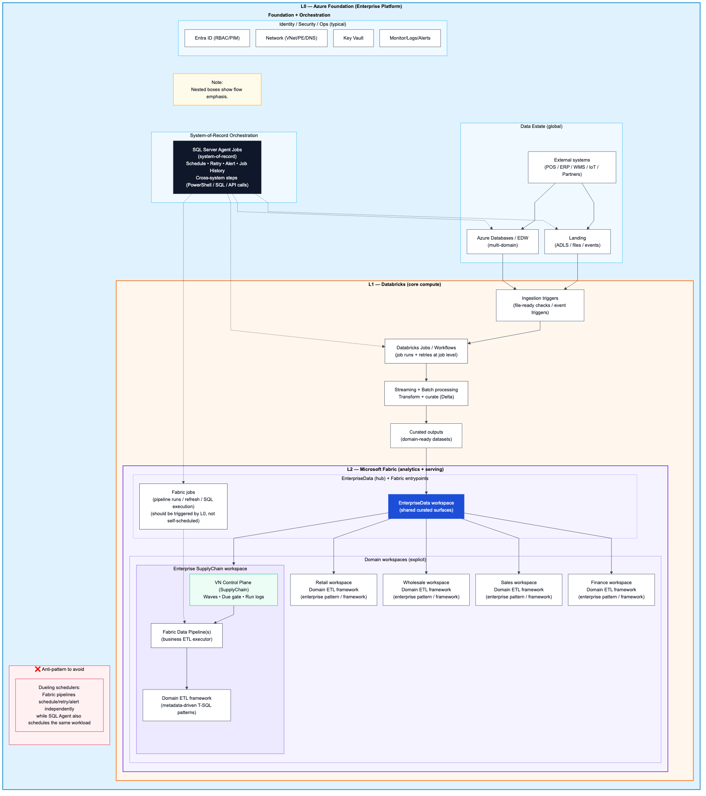

# overall_architecture_ashley.md — Ashley Enterprise → Databricks → Fabric (VN domains)

## Diagram (Mermaid → SVG/PNG)

## Legend / Glossary

See: `overall_architecture_ashley_legend.md`

### Overview (recommended)




### Scheduling patterns


### Legacy drafts (kept for iteration history)





> Mục tiêu: vẽ “big picture” theo đúng góc nhìn enterprise (US) mà Bob mô tả: **1 system-of-record orchestrator** bọc toàn bộ; compute chính ở **Databricks**; publish/serve ở **Fabric (EnterpriseData → domain workspaces)**; VN Control Plane là **domain runtime capability** (waves/due gate/run logs), không phải tool thay thế enterprise scheduler.
>
> Lưu ý quan trọng (Zero-hallucination): tên dịch vụ Azure cụ thể (Event Hubs vs IoT Hub vs Kafka, SQL MI vs Synapse vs SQL Server on VM, ADF vs custom schedulers, v.v.) chưa được confirm → mình ghi theo **pattern** và đánh dấu trạng thái:
> - [Verified] = đúng theo tài liệu Microsoft / đúng logic nền tảng
> - [Likely] = phù hợp mô tả của Bob, nhưng chưa có inventory chi tiết
> - [Need-verify] = cần hỏi/scan hệ thống để chốt

---

## 0) TL;DR (1 phút)

- **L0 Orchestrator (Enterprise)**: SQL Server Agent Jobs (theo Bob) là “super orchestrator” bọc end-to-end: schedule, retries, alerting, job history, cross-system gating. [Likely]
- **L1 Compute/Curate (Enterprise)**: Databricks xử lý ingestion + streaming + transform + curate (Delta). [Likely]
- **L2 Fabric (EnterpriseData)**: workspace trung tâm publish “enterprise surfaces”; từ đó **tỏa ra domain workspaces** (SupplyChain, Finance, …) cho serving/BI. [Likely]
- **VN Control Plane** không phải “thêm 1 orchestrator” cạnh tranh L0, mà là **domain runtime control** (waves/due gate/run logs/DQ/lineage hooks) có thể chạy *dưới* L0. [Likely]
- “Cấm kỵ” là **dueling schedulers**: Fabric pipeline tự schedule/retry/alert song song với L0 cho cùng workload. [Likely]

---

## 1) Glossary ngắn (để nói chuyện không lệch nghĩa)

- **Orchestrator (L0)**: nơi “system-of-record” sở hữu schedule/retry/alert/job history cho toàn enterprise. (Bob: SQL Server Agent Jobs). [Likely]
- **Runtime engine / Control Plane (L1.5)**: quyết định “chạy asset nào, theo thứ tự nào, song song ra sao” dựa trên metadata/DAG/waves; trả lời câu hỏi ops theo asset-level. (VN: Meta.AssetRegistry + waves + RunLog…). [Likely]
- **Executor (L2)**: nơi thực thi work units (Spark jobs, SQL procs, Fabric activities, refresh calls…).

---

## 2) Overall architecture (3 lớp lồng nhau — từ Azure foundation → Databricks → Fabric)

```text
┌─────────────────────────────────────────────────────────────────────────────────────────────┐
│ L0 — ENTERPRISE AZURE FOUNDATION (Landing Zone + Security + Ops + Orchestration)            │
│                                                                                             │
│  Identity/Security/Ops (typical, [Need-verify] in Ashley):                                  │
│   - Entra ID (RBAC), Conditional Access, PIM                                                 │
│   - Network: VNets, Private Endpoints, DNS, firewalls                                        │
│   - Secrets: Key Vault                                                                       │
│   - Observability: Log Analytics / Monitor / alerts                                          │
│                                                                                             │
│  Data Estate (typical, [Need-verify]):                                                       │
│   - Operational DBs (ERP/WMS/TMS/CRM, POS, Manufacturing systems)                            │
│   - IoT / telemetry streams (plants, devices)                                                │
│   - Files/exports (SFTP, APIs, partner feeds)                                                │
│                                                                                             │
│  L0 Orchestrator (system-of-record) — "SUPER ORCHESTRATION"                                 │
│   - SQL Server Agent Jobs (Bob) [Likely]                                                     │
│   - Owns: schedule + retries + alerting + job history + cross-system gating                 │
│   - Steps can run: SQL, PowerShell, invoke APIs, start other jobs, trigger downstream runs  │
│                                                                                             │
│                   (L0 orchestrator triggers work units; NOT all logic lives here)           │
│                                        │                                                    │
└────────────────────────────────────────┼────────────────────────────────────────────────────┘
                                         │
                                         v
┌─────────────────────────────────────────────────────────────────────────────────────────────┐
│ L1 — DATABRICKS LAYER (Core compute & curation)                                              │
│                                                                                             │
│  Ingestion (batch/stream) [Need-verify exact services]:                                      │
│   - Event streaming: Event Hubs / IoT Hub / Kafka                                            │
│   - Batch landing: ADLS Gen2                                                                  │
│   - CDC/replication: (tooling varies)                                                        │
│                                                                                             │
│  Processing:                                                                                │
│   - Streaming ETL (structured streaming)                                                     │
│   - Batch ETL/ELT                                                                            │
│   - Data quality checks (if implemented)                                                     │
│   - Delta Lake tables (bronze/silver/gold style inside lakehouse)                            │
│                                                                                             │
│  Outputs: curated datasets + domain-ready tables/views (Delta)                               │
│                                        │                                                    │
└────────────────────────────────────────┼────────────────────────────────────────────────────┘
                                         │ publish/serve surfaces
                                         v
┌─────────────────────────────────────────────────────────────────────────────────────────────┐
│ L2 — MICROSOFT FABRIC (EnterpriseData hub → Domain workspaces)                               │
│                                                                                             │
│  EnterpriseData workspace (hub)                                                              │
│   - Shared/curated surfaces (Enterprise Silver/Gold)                                         │
│   - Governance-facing contract surfaces (dictionary, audit expectations)                     │
│                                                                                             │
│                         ┌─────────────── publish / share / shortcuts ────────────────┐      │
│                         v                                                            v      │
│  Domain workspace: SupplyChain         Domain workspace: Finance              Domain: ...    │
│   - Domain transforms (warehouse/lakehouse)                                        ...      │
│   - Serving: semantic models / reports (Direct Lake, etc.)                                 │
│                                                                                             │
│  VN Control Plane capability (domain runtime)                                                │
│   - Metadata registry (assets, deps, schedule intent)                                        │
│   - Waves (dependency-safe parallelism)                                                      │
│   - Due gate (asset-level)                                                                   │
│   - Run-level logs (rows/duration/error per asset)                                           │
│   - (optional) DQ gate modes + lineage hooks                                                 │
│                                                                                             │
└─────────────────────────────────────────────────────────────────────────────────────────────┘
```

**Ý quan trọng**: L0 orchestrator *không cần biến mất*. Nó gọi xuống L2/L1 như 1 step, nhưng runtime control (waves/due gate) nằm “bên trong domain”. [Likely]

---

## 3) Control boundaries (ai sở hữu cái gì)

Mục tiêu section này: tránh hiểu lầm kiểu “VN đang build 1 orchestration tool thay SQL Agent”.

```text
                 OWNERSHIP / SOURCE-OF-TRUTH

  L0 Orchestrator (Enterprise)        L1.5 Control Plane (VN Domain)             L2 Executors
  ----------------------------        --------------------------------           -------------------
  - When to run (schedule)            - What assets to run (metadata)            - Do the work
  - Retries/backoff policy            - Dependency order (DAG -> waves)          - SQL procs
  - Alerting/notifications            - Due gate filtering                         - Spark jobs
  - Cross-system gating               - Per-asset run logs                         - Fabric activities
  - “single pane” job history         - Domain-level ops answers                    - refresh calls
```

Nếu bạn cần 1 câu “đóng đinh” để viết mail:
- **SQL Agent = enterprise scheduler** (L0).  
- **VN Control Plane = domain runtime engine** (L1.5).  
- **Fabric pipelines (nếu có) = executor wrapper** (L2), không sở hữu schedule/retry/alert toàn enterprise. [Likely]

---

## 4) “Cấm kỵ” (anti-pattern) — Fabric pipeline trở thành scheduler thứ 2

Fabric pipeline có thể schedule/event-trigger. [Verified]
Nhưng enterprise thường xem đây là nguy cơ nếu nó làm **system-of-record** song song với SQL Agent.

```text
❌ Dueling schedulers (split brain)

SQL Server Agent (L0) schedules "Retail Daily"  ─────┐
                                                     ├─ both think they own timing/retry/alerts
Fabric Pipeline (L2) also schedules same workload ────┘

Outcomes:
- Retry xảy ra ở 2 nơi (khó dự đoán)
- Alerting phân mảnh (on-call không biết tin ai)
- Job history không còn “single pane”
- Ownership mơ hồ (team nào chịu trách nhiệm SLO)
```

---

## 5) “Hợp lệ” (preferred) — SQL Agent bọc ngoài, Control Plane chạy bên trong

```text
✅ Single system-of-record scheduler

SQL Server Agent Job (Retail Daily)
  Step 10: "Run SupplyChain domain batch"  ---> calls ONE entrypoint (API/SQL/pipeline run)
                                               |
                                               v
                                       VN Control Plane
                                         - reads registry
                                         - computes waves
                                         - executes assets (parallel)
                                         - writes run logs
```

Lợi ích:
- L0 giữ nguyên “enterprise ops posture” (history/retry/alerting).
- Domain vẫn có runtime intelligence (waves/due gate/run logs).
- Không tạo thêm “một scheduler nữa”. [Likely]

---

## 6) Where Fabric pipelines fit (nếu vẫn cần dùng)

Fabric pipelines **không bị cấm tuyệt đối**. Cấm là “tự thành orchestrator thứ 2”.

Các use case “OK”:
- Dùng pipeline như **executor wrapper**: 1 pipeline run = 1 “domain batch run”, không tự schedule. [Likely]
- Dùng pipeline cho **activities integration** (copy/web/lookup/foreach) nhưng được trigger từ L0. [Likely]
- Dùng event-trigger trong Fabric chỉ khi enterprise chấp thuận “system-of-record scheduler” chuyển sang event-driven (chốt ownership lại). [Need-verify]

---

## 7) Questions to verify (để biến sơ đồ này thành “Ashley-accurate”)

Checklist cần hỏi Bob/Saravan (để chuyển [Need-verify] → [Verified]):
1) L0 orchestrator chính xác là gì ngoài SQL Agent? (ADF? Control-M? Airflow? custom?) [Need-verify]
2) Ingestion streaming cụ thể: IoT Hub/Event Hubs/Kafka? [Need-verify]
3) Databricks: Workflows/Jobs đang được trigger bằng gì? [Need-verify]
4) Fabric EnterpriseData: publish mechanism là shortcuts? lakehouse? warehouse? [Need-verify]
5) Domain workspaces: ai “owns serving” (04_semantic/report) và SLO refresh? [Need-verify]
6) “Events” họ muốn (Louise đề cập) là event-driven kiểu nào: file-arrival, table-ready, business-event? [Need-verify]

---

## 8) Suggested email positioning (1 paragraph)

> “We’re not proposing to replace your enterprise scheduler (SQL Server Agent). Our Fabric pipelines are simple domain ETL executors. The distinct piece we want to share is the VN Control Plane runtime capability (metadata-driven dependency waves, due-gating, and asset-level run logs), which can run under your existing orchestration as a single step.”
