# DA Onboarding - Thêm Hoặc Sửa Mart

Tài liệu này dành cho DA / Analytics Engineer, tức người hiểu business logic, report requirement và ý nghĩa dữ liệu.

DA không cần tự vận hành toàn bộ Fabric infrastructure. Điều quan trọng là DA phải mô tả đủ rõ logic, source, grain, key, DQ và semantic impact để DE có thể đưa logic đó vào hệ thống Enterprise ETL runtime một cách an toàn.



Mermaid source: [da_onboarding_flow.mmd](da_onboarding_flow.mmd)

## DA Sở Hữu Phần Nào?

| Khu vực | DA cần chịu trách nhiệm |
|---|---|
| Business question | Bảng/mart này trả lời câu hỏi nghiệp vụ gì? |
| Source contract | Source nào được dùng, source nào không còn active. |
| Grain | Một dòng dữ liệu đại diện cho điều gì. |
| Key | Cột nào là business key, cột nào bắt buộc không null. |
| Date logic | Snapshot date, transaction date, fiscal/calendar logic, freshness expectation. |
| SQL logic | Logic Bronze/Silver/Gold hoặc thay đổi SQL nghiệp vụ. |
| DQ expectation | Rule về null, duplicate, freshness, accepted values, exception. |
| Semantic impact | Ảnh hưởng tới semantic model, measure, relationship, report. |
| Handoff | Ghi chú đủ rõ để DE build, validate và vận hành. |

## DA Không Cần Sở Hữu Phần Nào?

| Khu vực | Ai thường sở hữu |
|---|---|
| Setup scheduler / SQL Agent job | DE / Enterprise ETL operations |
| Publish SQLPROJ lên environment | DE / platform owner / reviewer |
| Permission Fabric workspace | DE / platform owner |
| Nội bộ Enterprise ETL loader | Enterprise ETL framework owner / DE |
| Quyết định live refresh production | Operations owner |

## Workflow Chuẩn Cho DA

### Step 1 - Bắt Đầu Từ Bản Đồ Repo

Đọc:

```text
README.md
CONTEXT.md
02_marts/README.md
01_docs/glossary.md
```

`CONTEXT.md` dùng để biết trạng thái mới nhất. Không copy số liệu audit cũ vào tài liệu thiết kế mới nếu số liệu đó chỉ là bằng chứng tại một thời điểm.

### Step 2 - Xác Định Scope

Xác định request thuộc loại nào:

```text
mart mới
bảng mới trong mart hiện có
sửa bảng hiện có
chỉ đổi semantic/report
chỉ thêm hoặc sửa DQ rule
```

Khi mô tả, dùng placeholder rõ:

```text
<mart_name>
<source_domain>
<source_table>
<silver_schema>
<silver_table>
<gold_schema>
<gold_table>
```

### Step 3 - Ghi Source Contract

Với mỗi source table, DA nên ghi:

```text
source system / lakehouse / warehouse
schema.table
ý nghĩa business
freshness mong đợi
grain mong đợi
duplicate có được phép không
null ở key có được phép không
filter bắt buộc
source đang active hay chỉ còn historical
```

Nơi lưu:

```text
02_marts/<mart_name>/01_bronze/
02_marts/<mart_name>/04_dq/contracts/bronze_sources.json
```

Nếu chưa chắc source nào đúng, ghi là open question. Không đoán.

### Step 4 - Định Nghĩa Grain Và Key

Trước khi viết SQL, hãy viết được đoạn này:

```text
Table: <target_table>
Một dòng đại diện cho: <business grain>
Natural key: <columns>
Cột bắt buộc not-null: <columns>
Cột date/freshness: <column or none>
Duplicate rule: <không cho phép / cho phép / cần business exception>
```

Grain và key là nền tảng cho DQ, semantic relationship và incremental load.

### Step 5 - Đặt SQL Vào Đúng Layer

Cấu trúc mart:

```text
02_marts/<mart_name>/
  01_bronze/
  02_silver/
  03_gold/
```

Silver và Gold đi theo pattern Enterprise ETL:

```text
Final table:
  <SchemaName>.<TableName>

Source/work view:
  <SchemaName>_Wrk.v_<TableName>
```

SQL của DA nên làm rõ:

```text
output columns
business calculation
join logic
filter logic
deduplication assumption
date/snapshot logic
grain có bị thay đổi không
```

### Step 5A - Sửa Logic Cho Một Bảng Đang Có

Nếu DA chỉ muốn sửa logic của một bảng đã tồn tại, bắt đầu bằng cách tìm đúng file theo tên bảng.

Ví dụ với Silver:

```text
Final table contract:
  02_marts/<mart_name>/02_silver/<SchemaName>/<TableName>.table.sql

Work/source view SQL:
  02_marts/<mart_name>/02_silver/<SchemaName>_Wrk/v_<TableName>.sql
```

Ví dụ với Gold:

```text
Final table contract:
  02_marts/<mart_name>/03_gold/<SchemaName>/<TableName>.table.sql

Work/source view SQL:
  02_marts/<mart_name>/03_gold/<SchemaName>_Wrk/v_<TableName>.sql
```

DA thường sửa business SQL trong file `_Wrk/v_<TableName>.sql`. File `<TableName>.table.sql` dùng để ghi contract của final physical table: cột, kiểu dữ liệu, grain, key và ghi chú quan trọng. Nếu thay đổi output column trong view, phải kiểm tra file table contract và semantic impact cùng lúc.

Không tạo base-schema duplicate view kiểu `<SchemaName>.v_<TableName>` cho work mới. Enterprise ETL loader sẽ lấy source từ:

```text
<SchemaName>_Wrk.v_<TableName>
```

và load vào final table:

```text
<SchemaName>.<TableName>
```

### Step 5B - Thêm Một Bảng Mới Vào Mart Hiện Có

Khi thêm bảng mới, DA cần tạo hoặc yêu cầu DE tạo đủ một cặp table/view theo đúng layer.

Ví dụ thêm Silver table:

```text
02_marts/<mart_name>/02_silver/<SchemaName>/<TableName>.table.sql
02_marts/<mart_name>/02_silver/<SchemaName>_Wrk/v_<TableName>.sql
```

Ví dụ thêm Gold table:

```text
02_marts/<mart_name>/03_gold/<SchemaName>/<TableName>.table.sql
02_marts/<mart_name>/03_gold/<SchemaName>_Wrk/v_<TableName>.sql
```

Trong handoff, DA phải ghi rõ bảng mới thuộc loại nào:

```text
reference/shared dimension
mart-specific dimension
helper/intermediate output
fact table
snapshot table
semantic-only support table
```

Quy tắc chọn layer:

| Nếu bảng mới... | Nên đặt ở |
|---|---|
| Chuẩn hóa source, tạo line-level hoặc helper dùng lại cho nhiều Gold object | `02_silver/` |
| Là dimension/fact/helper đã sẵn sàng cho report hoặc semantic model | `03_gold/` |
| Chỉ mô tả source/shortcut đang active | `01_bronze/` |
| Chỉ là DQ rule/evidence | `04_dq/` |
| Chỉ là semantic binding hoặc lineage metadata | `05_catalog/` |

Bronze source file không phải view tạo bảng. Nó là source contract để người đọc biết source nào đang active:

```text
02_marts/<mart_name>/01_bronze/01_enterprise_lakehouse/Enterprise_Lakehouse.<schema>.<table>.sql
```

### Step 6 - Viết DQ Rule

Checklist tối thiểu:

```text
key không null
grain uniqueness
full-row duplicate nếu source kỳ vọng unique vật lý
freshness nếu có date/load timestamp đáng tin cậy
accepted values cho status/type quan trọng
referential check với dimension quan trọng
known exception kèm owner hoặc câu hỏi cần xác nhận
```

Nơi lưu:

```text
02_marts/<mart_name>/04_dq/contracts/rules.json
02_marts/<mart_name>/04_dq/contracts/exceptions.json
```

Không giấu exception trong SQL. Exception cần được ghi rõ để reviewer hiểu.

### Step 7 - Ghi Semantic Impact

Ghi rõ:

```text
có thêm bảng semantic không
có thêm/xóa/rename cột không
measure nào bị ảnh hưởng
relationship nào bị ảnh hưởng
report page nào có thể bị ảnh hưởng
có backward compatibility issue không
```

Nơi lưu:

```text
02_marts/<mart_name>/05_catalog/semantic_bindings.json
04_semantic/
```

### Step 8 - Bàn Giao Cho DE

DA handoff nên có:

```text
mart name
business owner
source tables
target Silver/Gold tables
grain và key
SQL files thay đổi
DQ rules và exceptions
semantic/report impact
refresh cadence mong muốn
rủi ro hoặc câu hỏi đang mở
```

DE sẽ kiểm tra live Fabric, update SQLPROJ, xác nhận wrapper/runtime order, build package và chuẩn bị handoff vận hành.

## Cách Đưa Bảng Vào ETL Wave

DA không cần tự chạy live refresh, nhưng DA cần chỉ đúng bảng nằm ở wave nào. Nếu không ghi wave rõ, DE sẽ phải đoán dependency và rất dễ xếp sai thứ tự.

### Wave Được Hiểu Như Thế Nào?

```text
Wave thấp chạy trước wave cao.
Trong cùng một wave, repo đang ghi thứ tự bằng step number.
Object downstream phải nằm ở wave sau object upstream mà nó SELECT/JOIN từ đó.
```

Ví dụ đơn giản:

```text
Silver Wave 0: source snapshot, reference/master, foundation table
Silver Wave 1: table dùng trực tiếp Wave 0
Silver Wave 2: aggregate/helper dùng Wave 1

Gold Wave 00 / gold_shared: shared dimensions
Gold Wave 10 / gold_dim: mart dimensions
Gold Wave 20 / gold_helper: helper/status outputs
Gold Wave 30 / gold_fact: facts/report-facing outputs
```

### File Nào Ghi Run Order?

Với mỗi mart:

```text
03_operations/orchestration/<mart_name>/manifest.yaml
03_operations/orchestration/<mart_name>/manifest.json
03_operations/orchestration/<mart_name>/sql/<Warehouse>.dbo.<WrapperProc>.sql
02_marts/<mart_name>/05_catalog/run_order.json
```

Trong thực tế:

| File | DA cần làm gì? |
|---|---|
| `manifest.yaml` | Ghi hoặc đề xuất object, wave, step, load_type, purpose. Đây là file dễ đọc nhất. |
| `manifest.json` | Bản machine-readable tương ứng; DE/tool có thể sync từ manifest. |
| `sql/<WrapperProc>.sql` | DE phải đảm bảo wrapper proc gọi Enterprise ETL loader theo đúng wave/step. |
| `05_catalog/run_order.json` | Generated metadata để AI/tool/DE đọc nhanh; không nên sửa tay nếu có thể regenerate. |

### DA Cần Ghi Một Entry Wave Như Thế Nào?

Mẫu entry trong manifest:

```yaml
- step: <number>
  wave: <wave_number_or_name>
  object: <SchemaName>.<TableName>
  load_type: <manifest|overwrite|DateKey|incremental|read_only>
  purpose: <one sentence business purpose>
```

Ví dụ Silver:

```yaml
- step: 320
  wave: 1
  object: InventoryHistory_Enh.AwdHelper
  load_type: overwrite
  purpose: AWD helper used by downstream inventory health outputs
```

Ví dụ Gold:

```yaml
- step: 500
  wave: gold_fact
  object: InventoryHealth_DW.FactInventoryHealthSnapshot
  load_type: manifest
  purpose: Main inventory health report-facing fact
```

Nếu bảng mới phụ thuộc bảng nào, ghi thẳng trong handoff:

```text
<new_table> must run after <upstream_table_1>, <upstream_table_2>.
Suggested wave: <wave>.
Reason: <short dependency reason>.
```

### Wrapper Procedure Sẽ Gọi Gì?

Wrapper proc không gọi view trực tiếp. Nó gọi Enterprise ETL loader với final table:

```sql
EXEC [ETL_Framework].[DW_Developer].[usp_RefreshCuratedTableFromView]
    '<WarehouseName>', '<SchemaName>', '<TableName>';
```

Enterprise ETL loader sẽ tự map:

```text
Target table:
  <WarehouseName>.<SchemaName>.<TableName>

Source view:
  <WarehouseName>.<SchemaName>_Wrk.v_<TableName>
```

Vì vậy nếu DA đổi tên table hoặc view, hai tên này phải còn khớp theo contract.

### Checklist Khi Add Bảng Vào Wave

```text
[ ] Có final table contract: <SchemaName>/<TableName>.table.sql
[ ] Có work/source view: <SchemaName>_Wrk/v_<TableName>.sql
[ ] View output column khớp final table contract.
[ ] Source upstream đã có trong Bronze/Silver/Gold layer tương ứng.
[ ] Grain và key đã ghi rõ.
[ ] DQ rule đã có hoặc có lý do chưa có.
[ ] manifest.yaml có object, wave, step, load_type, purpose.
[ ] Wrapper proc cần thêm EXEC mới hoặc xác nhận đã có.
[ ] Nếu ảnh hưởng report, semantic impact đã ghi.
```

## Checklist Trước Khi Gửi Review

```text
[ ] Source tables đã rõ active/historical.
[ ] Grain được viết bằng ngôn ngữ business.
[ ] Key và not-null columns đã rõ.
[ ] SQL nằm đúng layer trong mart package.
[ ] Nếu sửa bảng đang có, đã sửa đúng `_Wrk/v_<TableName>.sql` và kiểm tra `<TableName>.table.sql`.
[ ] Nếu thêm bảng mới, đã có đủ final table contract + `_Wrk` view contract.
[ ] Nếu cần chạy trong ETL, đã đề xuất wave/step/load_type/purpose trong manifest.
[ ] DQ rule được viết thành contract, không chỉ ghi prose.
[ ] Known exceptions có owner hoặc câu hỏi.
[ ] Semantic/report impact đã rõ.
[ ] Không nhét số liệu audit tại một thời điểm vào template docs.
```

## Câu Hỏi DA Nên Hỏi DE

```text
Source này hiện có trên live Fabric chưa?
Tên schema/table đã đúng chuẩn Enterprise ETL chưa?
_Wrk view có map đúng với final table không?
Bảng này nên chạy ở wave nào?
Load pattern là full refresh, incremental append, incremental merge, SCD2 hay date-range?
DQ smoke nào cần pass trước khi semantic/report validation?
```
