# Fabric SupplyChain Operating Repo

> Repo tài liệu và vận hành cho kiến trúc SupplyChain trên Microsoft Fabric, đã được chuẩn hóa theo hướng Enterprise ETL Framework.

Repo này không chỉ để lưu code SQL. Nó là nơi giải thích toàn bộ cách hệ thống dữ liệu SupplyChain đang được tổ chức, vận hành, kiểm tra chất lượng, triển khai thay đổi và bàn giao cho các nhóm khác.

Nói ngắn gọn:

```text
Business logic vẫn nằm ở Bronze / Silver / Gold.
Enterprise ETL Framework chịu trách nhiệm load, log, audit, metadata.
Repo này giúp DA, DE, reviewer và operations hiểu cùng một bức tranh.
```

## Câu Chuyện Tổng Quan

Trước đây hệ thống có nhiều lớp lịch sử: kiến trúc cũ, control plane tự xây, pipeline riêng, nhiều tài liệu reverse engineering và nhiều quyết định thử nghiệm. Sau Phase 1, hướng hiện tại đã được chốt lại:

```text
Giữ sản phẩm dữ liệu:
  source -> Bronze -> Silver -> Gold -> semantic/report

Chuẩn hóa cách vận hành:
  _Wrk view -> final table -> wrapper procedure -> Enterprise ETL loader -> AuditLog/TableDictionary

Chuẩn hóa cách triển khai thay đổi:
  SQL source trong repo -> SQLPROJ build -> .dacpac -> review -> publish có kiểm soát
```

Root README này là cửa chính. Nếu bạn mới vào repo, hãy đọc từ đây trước, rồi đi theo vai trò của mình.

## Đọc Theo Vai Trò



Mermaid source: [readme_operating_map.mmd](01_docs/architecture/current/readme_operating_map.mmd)

| Bạn là ai? | Nên đọc trước | Mục tiêu |
|---|---|---|
| DA / Analytics Engineer | [DA onboarding](01_docs/onboarding/da_onboarding.md) | Biết cách đưa business logic, source, grain, DQ và semantic impact vào repo để DE có thể vận hành. |
| DE / Platform Operator | [DE onboarding](01_docs/onboarding/de_onboarding.md) | Biết cách scan live Fabric, sync repo, build SQLPROJ, vận hành refresh, kiểm tra DQ và cập nhật context. |
| Reviewer / Architect | [Current architecture](01_docs/architecture/current/README.md) | Hiểu kiến trúc hiện tại, lý do dùng `_Wrk`, wrapper procedures và Enterprise ETL runtime. |
| Operations | [Operations](03_operations/README.md) | Biết manifest nào định nghĩa thứ tự chạy, dry-run ra sao, khi nào được live trigger. |
| CI/CD Owner | [SQLPROJ CI/CD guide](01_docs/runbook/guides/sqlproj_cicd_operating_guide_for_da.md) | Hiểu CI/CD triển khai SQL object như thế nào và khác gì với refresh dữ liệu. |

## Thư Viện Chính

| Khu vực | Dùng để làm gì? |
|---|---|
| [00_CONTEXT/current.md](00_CONTEXT/current.md) | Nhật ký trạng thái mới nhất, quyết định mới nhất, checkpoint để tiếp tục việc đang dở. |
| [01_docs/onboarding/](01_docs/onboarding/) | Hướng dẫn nhập môn theo vai trò DA và DE. |
| [01_docs/glossary.md](01_docs/glossary.md) | Giải thích thuật ngữ như `_Wrk`, `TableDictionary`, `SQLPROJ`, `.dacpac`, `semantic smoke`. |
| [01_docs/architecture/current/](01_docs/architecture/current/) | Kiến trúc hiện tại sau Phase 1. |
| [01_docs/enterprise-etl-framework/](01_docs/enterprise-etl-framework/) | Tài liệu Enterprise ETL gửi, cách repo này diễn giải để áp dụng, và ghi chú sync/audit framework live mới nhất. |
| [01_docs/decisions/](01_docs/decisions/) | ADR, tức các quyết định kiến trúc quan trọng và lý do chọn. |
| [02_marts/](02_marts/) | Nơi lưu logic theo từng mart: source, Bronze, Silver, Gold, DQ, catalog. |
| [03_operations/](03_operations/) | Nơi lưu manifest chạy luồng, wrapper SQL, registry, SQLPROJ package và tool vận hành. |
| [04_semantic/](04_semantic/) | Hợp đồng semantic/report, model notes và smoke test định hướng. |
| [05_tools/](05_tools/) | Script nội bộ để audit, sync, build package, dọn repo. |
| [99_archive/](99_archive/) | Kiến thức cũ, bản v8/v9/v10, bằng chứng reverse engineering. Không dùng làm nguồn sự thật hiện tại nếu không được link rõ. |

## Dòng Chảy Dữ Liệu



Hệ thống đi theo một câu chuyện rất quen thuộc với data platform:

```text
Source systems
  -> Enterprise_Lakehouse
  -> Bronze contract trong từng mart
  -> Silver processing tables
  -> Gold serving tables
  -> Semantic model / Power BI / downstream users
```

Điểm quan trọng là repo này không cố viết lại business logic từ đầu. Nó giữ nguyên lớp dữ liệu nghiệp vụ và thay đổi cách vận hành để khớp với Enterprise ETL/Enterprise pattern.

```text
Business surface:
  bảng, view, semantic, report mà user đang dùng

Operating surface:
  loader, wrapper procedure, audit log, metadata, DQ, CI/CD
```

## Một Mart Được Đóng Gói Như Thế Nào?



Mermaid source: [readme_mart_package_anatomy.mmd](01_docs/architecture/current/readme_mart_package_anatomy.mmd)

Mỗi mart trong `02_marts/` phải trả lời được 5 câu hỏi:

```text
1. Mart này lấy source nào?
2. Bronze / Silver / Gold có những object nào?
3. Object nào tạo ra object nào?
4. Thứ tự chạy đúng là gì?
5. DQ và semantic/report bị ảnh hưởng ra sao?
```

Cấu trúc chuẩn:

```text
02_marts/<mart_name>/
  00_source_wrk/    ghi chú source wrapper hoặc prep object
  01_bronze/        source/shortcut contract đang active
  02_silver/        table contract và _Wrk view SQL cho Silver
  03_gold/          table contract và _Wrk view SQL cho Gold
  04_dq/            rule, exception và evidence DQ dạng JSON
  05_catalog/       asset, lineage edge, run order, semantic binding
  99_history/       logic cũ hoặc ghi chú không còn active
  README.md         hướng dẫn riêng của mart
```

## Enterprise ETL Runtime Chạy Bảng Như Thế Nào?



Mermaid source: [readme_enterprise_etl_loader_contract.mmd](01_docs/architecture/current/readme_enterprise_etl_loader_contract.mmd)

Đây là phần dễ gây rối nhất, nên hãy nhớ một câu:

```text
Business SQL nằm trong _Wrk view.
Kết quả cuối nằm trong final table.
Wrapper procedure quyết định thứ tự chạy.
Enterprise ETL loader thực hiện load và ghi log.
```

Mẫu mapping:

```text
Final table:
  <Warehouse>.<SchemaName>.<TableName>

Source/work view:
  <Warehouse>.<SchemaName>_Wrk.v_<TableName>

Loader work table tạm thời:
  <Warehouse>.<SchemaName>.<TableName>_LOAD

Metadata:
  ETL_Framework.DW_Developer.TableDictionary

Runtime log:
  ETL_Framework.DW_Developer.AuditLog
```

Giải thích nhanh:

| Thuật ngữ | Nghĩa ngắn gọn |
|---|---|
| `_Wrk view` | View chứa SQL logic để tạo dữ liệu cho bảng đích. |
| Final table | Bảng vật lý downstream sẽ dùng. |
| Wrapper procedure | Stored procedure gọi nhiều bảng theo đúng thứ tự dependency/wave. |
| Enterprise ETL loader | Procedure framework thực hiện load, swap/materialize, log audit và cập nhật metadata. |
| `TableDictionary` | Bảng đăng ký metadata: table nào, source view nào, load pattern nào. |
| `AuditLog` | Bảng log lần chạy: start, complete, error, duration. |

Ghi chú runtime mới:

- `Enterprise SupplyChain-Dev.ETL_Framework` đã được sync từ `EnterpriseData-Dev` theo hướng additive vào ngày `2026-07-02`
- `DW_Developer.Usp_TableFromParquet_RowADF` bị loại khỏi SupplyChain vì object nguồn broken
- `DW_Developer.Usp_SnapshotLoad` đã được vá tối thiểu để hoạt động với metadata live của SupplyChain
- chi tiết xem [2026-07-02 live sync and pattern audit](01_docs/enterprise-etl-framework/2026-07-02_live_sync_and_pattern_audit.md)

## CI/CD Là Gì Trong Repo Này?

CI/CD không phải là refresh dữ liệu. CI/CD là đường kiểm soát thay đổi SQL object.



Mermaid source: [readme_cicd_to_runtime_flow.mmd](01_docs/architecture/current/readme_cicd_to_runtime_flow.mmd)

Luồng triển khai object:

```text
DA/DE sửa SQL trong repo
  -> tạo PR / review
  -> CI build .sqlproj
  -> tạo .dacpac
  -> sinh DeployReport / Script để reviewer xem
  -> CD publish object đã được duyệt lên environment
```

CI/CD quản lý:

```text
schema
table definition
view definition
stored procedure
function
permission/policy nếu được đưa vào project
```

CI/CD không tự quyết:

```text
khi nào refresh dữ liệu
dữ liệu có đúng nghiệp vụ chưa
DQ exception có được chấp nhận không
semantic/report có pass chưa
production có được chạy live hay không
```

Đọc thêm: [SQLPROJ CI/CD guide](01_docs/runbook/guides/sqlproj_cicd_operating_guide_for_da.md)

## Runtime Refresh Chạy Như Thế Nào?

Runtime refresh là lúc hệ thống thật sự nạp dữ liệu vào bảng.

```text
SQL Agent hoặc approved trigger
  -> gọi wrapper procedure
  -> chạy shared/reference wave trước nếu cần
  -> chạy Silver/Gold theo đúng wave
  -> mỗi table gọi Enterprise ETL loader
  -> loader đọc _Wrk view
  -> ghi final table
  -> ghi AuditLog và TableDictionary
  -> chạy DQ / semantic smoke nếu cần
```

Thứ tự chạy không được đoán theo tên bảng. Thứ tự phải lấy từ:

```text
03_operations/orchestration/*/manifest.json
03_operations/operating_registry/run_order.json
wrapper procedure SQL
```

Dry-run an toàn:

```bash
python3 03_operations/tools/run_refresh.py --manifest 03_operations/orchestration/main/manifest.json
```

Live trigger cần approval rõ trong cùng conversation:

```bash
python3 03_operations/tools/run_refresh.py --manifest 03_operations/orchestration/main/manifest.json --execute
```

## CI/CD Và Runtime Kết Hợp Với Nhau


Mermaid source: [readme_full_lifecycle.mmd](01_docs/architecture/current/readme_full_lifecycle.mmd)

Hãy tách rõ 2 cổng kiểm soát:

```text
Gate 1 - Object deployment:
  SQL object có an toàn để publish không?

Gate 2 - Data/runtime validation:
  Dữ liệu sau khi load có pass audit, DQ và semantic smoke không?
```

Vòng đời điển hình:

```text
DA định nghĩa business logic
  -> đóng gói vào mart folder
  -> DE kiểm tra source, schema, _Wrk, DQ, semantic impact
  -> SQLPROJ build và tạo package review
  -> object được publish sau approval
  -> scheduler hoặc approved trigger chạy wrapper
  -> Enterprise ETL loader refresh table
  -> AuditLog / TableDictionary / DQ / semantic smoke được kiểm tra
  -> context và docs được cập nhật
```

## DA Cần Quan Tâm Gì?


DA tập trung vào ý nghĩa dữ liệu:

```text
business question
source contract
grain và key
Bronze / Silver / Gold SQL
DQ expectation
semantic/report impact
handoff notes cho DE
```

DA không cần tự setup scheduler, SQL Agent job hoặc Enterprise ETL loader. Nhưng DA phải mô tả rõ logic và contract để DE vận hành được.

Đọc: [DA onboarding](01_docs/onboarding/da_onboarding.md)

## DE Cần Quan Tâm Gì?



DE tập trung vào việc biến logic thành hệ thống vận hành được:

```text
scan live Fabric
sync repo với live truth
build SQLPROJ
kiểm tra _Wrk/final table/wrapper contract
regenerate DQ/catalog package
dry-run hoặc approved refresh
kiểm tra AuditLog, TableDictionary, DQ, semantic smoke
cập nhật context và docs
```

Đọc: [DE onboarding](01_docs/onboarding/de_onboarding.md)

## DQ Và Catalog Được Lưu Ở Đâu?

Repo tránh ghi DQ/lineage chỉ bằng văn xuôi. Các phần quan trọng được lưu dạng JSON để người và AI đều đọc được.

```text
02_marts/<mart>/04_dq/contracts/bronze_sources.json
02_marts/<mart>/04_dq/contracts/rules.json
02_marts/<mart>/04_dq/contracts/exceptions.json
02_marts/<mart>/04_dq/runs/latest.json

02_marts/<mart>/05_catalog/assets.json
02_marts/<mart>/05_catalog/lineage_edges.json
02_marts/<mart>/05_catalog/run_order.json
02_marts/<mart>/05_catalog/semantic_bindings.json

03_operations/operating_registry/*.json
```

Regenerate package:

```bash
python3 05_tools/04_operating_package/build_operating_package.py --repo-root .
```

## Nguồn Sự Thật Khi Tài Liệu Mâu Thuẫn

Nếu hai tài liệu nói khác nhau, dùng thứ tự này:

```text
1. AGENTS.md
2. 00_CONTEXT/current.md
3. 01_docs/architecture/current/final_enterprise_etl_runtime_architecture.md
4. 01_docs/Enterprise_Framework_Migration_Master_Plan.md
5. 03_operations/orchestration/*/manifest.json
6. 02_marts/<mart> SQL + DQ/catalog contracts
7. 99_archive chỉ dùng làm bằng chứng lịch sử
```

## Luật An Toàn

```text
Đọc context trước khi làm.
Dry-run trước khi live refresh.
Không chạy theo alphabet, chạy theo manifest/wrapper order.
Không publish SQLPROJ nếu chưa có owner và approval gate.
Không delete/drop/truncate/reset nếu chưa được approve rõ trong cùng conversation.
Sau thay đổi có ý nghĩa, cập nhật context.
```

## Link Chính Thức

- Microsoft Fabric Warehouse projects: <https://learn.microsoft.com/fabric/data-warehouse/develop-warehouse-project>
- SQL projects automation: <https://learn.microsoft.com/sql/tools/sql-database-projects/sql-projects-automation?view=sql-server-ver17>
- SQL project database references: <https://learn.microsoft.com/sql/tools/sql-database-projects/concepts/database-references?view=sql-server-ver17>
