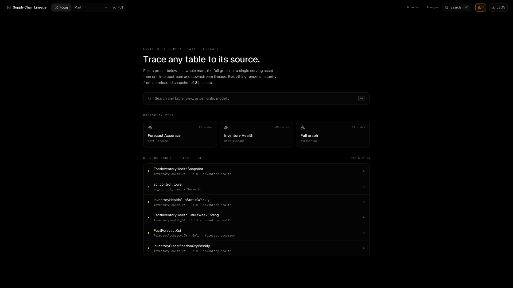
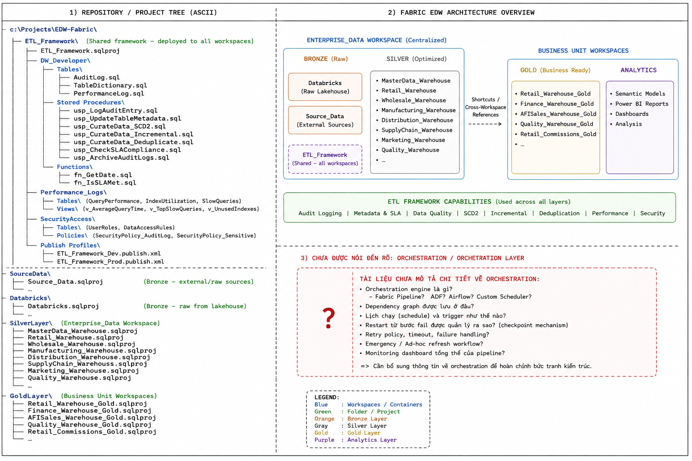

# Supply Chain Data Architecture - Enterprise ETL Framework Edition

> Documentation and operations repo for the Supply Chain architecture on Microsoft Fabric, aligned to the Enterprise ETL Framework. Phase 1 closeout: 2026-06-24. Live audit: 2026-07-24.

[](01_docs/runbook/artifacts/20260622_phase1a_baseline/phase1h/phase1_done_handoff_20260623.md)
[](https://learn.microsoft.com/fabric/data-warehouse/)
[](https://ankinguyen-engineer-2002.github.io/data-architecture-microsoft-medallion-vietnam-data-hub/)
[](#4-live-audit-evidence)
[](.github/workflows/lineage-portal.yml)
[](#15-safety-rules)



<sub>Live screenshot of the lineage portal - 990 nodes, 1195 edges, 0 warnings - snapshot auto-refreshed via GitHub Actions every 2 hours.</sub>

---

## Table of Contents

1. [The Story](#1-the-story)
2. [Architecture Overview](#2-architecture-overview)
3. [Fabric Scope Lock](#3-fabric-scope-lock)
4. [Live Audit Evidence](#4-live-audit-evidence)
5. [Repository Structure](#5-repository-structure)
6. [Read By Role](#6-read-by-role)
7. [Runtime Contract](#7-runtime-contract)
8. [Mart Package Anatomy](#8-mart-package-anatomy)
9. [CI/CD and Full Lifecycle](#9-cicd-and-full-lifecycle)
10. [Lineage Portal](#10-lineage-portal)
11. [Daily Operations](#11-daily-operations)
12. [Key Terms](#12-key-terms)
13. [ADR Index](#13-adr-index)
14. [Truth Hierarchy](#14-truth-hierarchy)
15. [Safety Rules](#15-safety-rules)
16. [Official Links](#16-official-links)

---

## 1. The Story

This repo is not just a SQL code store. It explains the entire way the Supply Chain data system is organized, operated, quality-checked, deployed, and handed off to other teams.

```
Business logic stays in Bronze / Silver / Gold.
Enterprise ETL Framework owns load, log, audit, metadata.
Lineage Portal lets everyone see the lineage picture from a browser.
```

The system has gone through 3 phases to reach its current state:

```
Phase 1 -- Reverse engineering (v8/v9/v10):
  desk-research + live Fabric audit to understand current state, debt, and risks.

Phase 2 -- Phase 1 refactor (2026-06-22 to 2026-06-24):
  standardize runtime to Enterprise ETL Framework, _Wrk view contract,
  wrapper procedures, TableDictionary/AuditLog. Closeout: 14 active refresh
  procedures, 96 TableDictionary rows across 27 schemas, 990 lineage nodes,
  0 drift, 0 warnings, 0 errors.

Phase 3 -- Lineage Portal live (2026-07):
  GitHub Actions scanner -> static snapshot -> Vite/React portal
  deployed on GitHub Pages. Browser never holds credentials.
```

Evidence of the architecture summary from the Enterprise ETL Framework email:



---

## 2. Architecture Overview


The system follows the standard Medallion pattern:

```
Source systems
  -> Enterprise_Lakehouse              (Bronze/source layer - 15 schemas)
  -> Bronze contract per mart          (per-mart staging / shortcuts)
  -> Silver processing tables          (SupplyChain_Processing_Warehouse - 63 schemas)
  -> Gold serving tables               (SupplyChain_Gold_Warehouse - 38 schemas)
  -> Semantic model / Power BI         (sc_control_tower, Direct Lake on Gold)
  -> Downstream users                  (DA, BA, operations, reports)
```

The key point: this repo does not rewrite business logic from scratch. It preserves the business data layer and changes the operating approach to match the Enterprise ETL pattern.

```
Business surface (preserved):
  tables, views, semantic models, reports that users consume today

Operating surface (standardized):
  loader, wrapper procedure, audit log, metadata, DQ, CI/CD, lineage portal
```

### Cross-workspace map


<sub>Source: cross_workspace_architecture.png. Overview diagram showing workspaces and data flow between Bronze/Silver/Gold/Semantic layers.</sub>

### Alternate view (runbook main architecture)



<sub>Source: 02_main_architecture.svg. Alternate view of the operating architecture for the runbook.</sub>

---

## 3. Fabric Scope Lock

| Resource | Workspace | ID |
|---|---|---|
| Tenant | 5a9d9cfd-c32e-4ac1-a9ed-fe83df4f9e4d | - |
| Workspace DEV | Enterprise SupplyChain-Dev | c8d9fc83-18b6-4e1d-8264-0b49eed36fe0 |
| Source Lakehouse | Enterprise_Lakehouse | 584e7d2c-46ca-49dc-bb6c-68df6ef4f424 |
| Processing Warehouse | SupplyChain_Processing_Warehouse | c0262cef-b8a7-495f-bccc-53b098c7948c |
| Gold Warehouse | SupplyChain_Gold_Warehouse | 98e2a911-5af9-442e-9cc8-5d8dadb8b762 |
| Local ETL Framework | ETL_Framework | d4eb02f9-c29e-4f0d-9870-43b5970b349f |
| Current semantic model | sc_control_tower | f06a2361-15fd-4f91-9d37-941fefe62aaf |
| SQL endpoint | 7woj2wroypauvkpn72b56t46ju-qp6ntsfwdaou5atebne65u3p4a.datawarehouse.fabric.microsoft.com | - |

> The legacy SupplyChain_Warehouse (e146ffe2-d907-46a7-9b7e-3e739a31b24e) and StagingWarehouseForDataflows are also present in the live workspace but are NOT part of the active Enterprise ETL runtime. See Live Audit Evidence below.

---

## 4. Live Audit Evidence

> Verified live: all data in this section comes from a direct Fabric REST + SQL scan performed on 2026-07-24T08:09:29Z. Evidence stored at 01_docs/runbook/artifacts/20260724_live_fabric_audit/.

### Workspace inventory (29 live items)

| Type | Count | Items |
|---|---|---|
| DataPipeline | 2 | pl_backup_full_refresh, pl_backup_per_table |
| Dataflow | 5 | SharepointDaily, temp_SCPDim, SundayWeekly_TempADW, OneTimeForecastSnapshotLoad, TempActualsLoad |
| Lakehouse | 3 | Enterprise_Lakehouse, SupplyChain_Lakehouse, StagingLakehouseForDataflows |
| MirroredDatabase | 1 | SCPGlobalTeam_SharepointLists |
| Notebook | 2 | Refresh SQL Endpoint Metadata, Notebook 1 |
| Report | 1 | Forecast Accuracy Gold |
| SQLEndpoint | 4 | Enterprise_Lakehouse, SupplyChain_Lakehouse, StagingLakehouseForDataflows, SCPGlobalTeam_SharepointLists |
| SemanticModel | 4 | temp_SCPModel (LEGACY), SupplyChain_Gold (LEGACY), Supply Chain Control Tower (LEGACY), sc_control_tower (CURRENT) |
| UserDataFunction | 1 | generateInventoryInsight |
| VariableLibrary | 1 | InvHealthVariables |
| Warehouse | 5 | ETL_Framework, SupplyChain_Warehouse (LEGACY), StagingWarehouseForDataflows, SupplyChain_Processing_Warehouse, SupplyChain_Gold_Warehouse |

> Note: the pl_sc_master, pl_sc_mart, pl_sc_staging, pl_sc_silver, pl_sc_silver_wave, pl_sc_gold, pl_dq_check pipelines listed in older docs are NOT live anymore. Only pl_backup_full_refresh and pl_backup_per_table exist in the workspace.

### Lineage snapshot statistics (990 nodes, 1195 edges)

| Layer | Nodes | Lane details |
|---|---|---|
| Bronze Sources | 33 | 33 source tables from Enterprise_Lakehouse |
| Silver W01 | 596 | Wave 01 main processing |
| Silver W02 | 13 | Wave 02 processing |
| Silver W03 | 5 | Wave 03 processing |
| Gold W01 | 311 | Main Gold output |
| Gold W01 Shared | 3 | Shared dimensions embedded in Gold wrapper |
| Gold W10 Dimensions | 3 | Dimension helper objects |
| Gold W20 Helpers | 3 | Helper objects |
| Gold W30 Facts | 4 | Fact objects |
| Semantic sc_control_tower | 19 | Model tables + measures |

| Edge type | Count |
|---|---|
| transforms_to | 1160 |
| belongs_to_model | 14 |
| semantic_binding | 13 |
| sql_reference | 4 |
| uses | 4 |

### TableDictionary (96 active rows across 27 schemas)

| Schema | Tables | Key tables |
|---|---|---|
| InventoryHistory_Enh | 13 | ATPWeekEnding, AwdHelper, Cogs52WWeekly, ForecastSnapshotWeekly, HoldingTransferSnapshotDaily, InventorySnapshotWeekly, ItemBalanceHistorical_WithInTransit, LastInvoiceWeekly, ManufacturingOrderSnapshotDaily, PurchaseOrderSnapshotHistorical, SafetyStockHelper, SupplyPlanDetail |
| SCP_Core (LEGACY) | 13 | DimCustomerMaster, DimFcstSnapshotDates, DimFiscalCalendar, DimSCPItemMaster, DimVendorMaster, DimWarehouseMaster, FactAFISales_CurReqQty, FactFcstErrorCalc, FactOpenOrders, FactWorkingForecastCurrent, FiscalCalendar, WorkingForecastCurrent |
| ReferenceMaster_Enh | 11 | Calendar, CustomerAccount, CustomerAccountGroup, CustomerGrouping, CustomerShippingLocation, ForecastCycle, ForecastHorizon, ItemMaster, OrderType, Vendor, Warehouse |
| InventoryHealth_DW | 7 | DimVendor, FactInventoryHealthFutureWeekEnding, FactInventoryHealthSnapshot, InventoryClassificationQtyWeekly, InventoryHealthSubStatusWeekly, ProjectedInventoryHealthSubStatus, SupplyPlanOutageClassHelper |
| SupplyChain_Enh | 6 | ATPWeekEnding, DemandForecastSnapshotDaily, DemandFulfillmentCommonContainer_Logility, DemandInventorySnapshotDaily, PurchaseOrderSnapshot, SupplyPlanDetailSnapshotDaily |
| Wholesale_Codis_AFI | 6 | AAORDTYP, AshleyWarehouseMaster, codatan, COMAST, EXTORD, EXTORIT |
| ItemMaster_AFI | 5 | AITMCLS, ITBEXT, ITEMBL, ITMEXT, ITMRVA |
| ForecastAccuracy_DW | 4 | DimCustomerGrouping, DimForecastHorizon, FactForecastActual, FactForecastKpi |
| SalesHistory_Enh | 4 | ActualDemandMonthly, ActualDemandWeekly, InvoiceDetailLineLevel, InvoiceWeekly |
| Shared_DW | 3 | DimCalendar, DimProduct, DimWarehouse |
| InventoryHistory_Enh_Wrk | 2 | v_HoldingTransferSnapshotDaily, v_ManufacturingOrderSnapshotDaily |
| Customers | 2 | AccountMaster, ShippingLocations |
| ForecastHistory_Enh | 2 | ForecastDemandMonthly, NaiveForecastMonthly |
| Manufacturing_Inventory_AFI | 2 | TFRDTL, TFRHDR |
| MasterData_DW | 2 | DimDate, DimItemMaster |
| OpenOrderHistory_Enh | 2 | OpenOrderLineLevel, OpenOrderMonthly |
| SalesHistory_AFI_Enh | 2 | InvoiceDetail, InvoiceHeader |
| CustomerOrders_AFI | 1 | WarehouseMaster |
| Staging | 1 | DemandForecastSnapshotDaily (Retired) |
| Staging_Wrk | 1 | v_DemandForecastSnapshotDaily |
| Inventory_Enh_History | 1 | ItemBalance |
| MasterData_ProductKnowledge | 1 | Item_ENV |
| InventoryHealth_Internal | 1 | InventorySnapshotWeeklyBase |
| Wholesale_ProductSourcing | 1 | NonPkItems |
| Wholesale_ProductSourcing_AFI | 1 | CustomerGrouping |
| Manufacturing_ProductionPlanning_AFI | 1 | MOMAST |
| Purchasing_AFI | 1 | VendorMaster |

### Active refresh procedures (14 total)

**SupplyChain_Processing_Warehouse (12 procs):**

| Schema | Proc | Modified | Role |
|---|---|---|---|
| dbo | Usp_Refresh_ForecastAccuracy_Silver_W01 | 2026-07-01 | Silver wrapper W01 |
| dbo | Usp_Refresh_ForecastAccuracy_Silver_W02 | 2026-07-23 | Silver wrapper W02 |
| dbo | Usp_Refresh_ForecastAccuracy_Silver_W03 | 2026-07-01 | Silver wrapper W03 |
| dbo | Usp_Refresh_InventoryHealth_Silver_W01 | 2026-07-01 | Silver wrapper W01 |
| dbo | Usp_Refresh_InventoryHealth_Silver_W02 | 2026-07-23 | Silver wrapper W02 |
| dbo | Usp_Refresh_InventoryHealth_Silver_W03 | 2026-07-01 | Silver wrapper W03 |
| dbo | Usp_Refresh_Shared_ReferenceMaster | 2026-07-01 | Shared prerequisite (Wave 00) |
| dbo | Usp_Refresh_Shared_Staging | 2026-07-10 | Shared staging prerequisite |
| DataQuality | usp_Capture_DQForecastAccuracy | 2026-07-09 | DQ capture |
| DataQuality | usp_GateForecastAccuracyPublish | 2026-07-22 | DQ publish gate |
| DataQuality | usp_RunForecastAccuracyDQ | 2026-07-23 | DQ runner |
| Staging_Wrk | usp_RefreshEdwTables | 2026-05-21 | EDW staging refresh |

**SupplyChain_Gold_Warehouse (2 procs):**

| Schema | Proc | Modified | Role |
|---|---|---|---|
| dbo | Usp_Refresh_ForecastAccuracy_Gold | 2026-07-23 | Gold wrapper (incl. Shared_DW Wave 00) |
| dbo | Usp_Refresh_InventoryHealth_Gold | 2026-07-21 | Gold wrapper (incl. Shared_DW Wave 00) |

**ETL_Framework (29 framework procs):**

Key procedures (full list in live audit evidence):

| Proc | Role |
|---|---|
| usp_IncrementalTableLoad | PRIMARY loader - performs load, swap/materialize, audit log |
| usp_IncrementalTableLoad_Backup | Backup variant |
| usp_IncrementalTableLoad_CDC | CDC variant |
| usp_RefreshCuratedTableFromView | Curated refresh from view |
| usp_SCD2_TableLoad | SCD Type 2 loader |
| usp_Audit_ADW_Tables | ADW audit |
| usp_Audit_Fabric_Tables | Fabric audit |
| usp_GrantSchemaSecurity | Schema security grant |
| usp_UpdateTableDictionary_ModifiedDate | TD modified date update |
| usp_UpdateTableDictionary_UpdateLog_RadarSync | TD update log sync |
| Usp_SnapshotLoad | Snapshot loader |
| Usp_CreateTableFromParquet (multiple variants) | Parquet-to-table loaders |
| Usp_WriteTableToParquet | Table-to-Parquet writer |

**SupplyChain_Warehouse (13 LEGACY procs):**

These are legacy procedures from the pre-Phase-1 runtime. They still exist live but are NOT part of the active Enterprise ETL runtime:

| Schema | Proc | Modified |
|---|---|---|
| dbo | usp_Load_Dim_Calendar | 2026-03-24 |
| dbo | usp_Load_Dim_Customer_Grouping | 2026-03-24 |
| dbo | usp_Load_Dim_Forecast_Horizon | 2026-03-24 |
| dbo | usp_Load_Dim_Product | 2026-03-24 |
| dbo | usp_Load_Dim_Warehouse | 2026-03-24 |
| dbo | usp_Load_DQ_Forecast_Accuracy | 2026-04-07 |
| dbo | usp_Load_Fact_Flat_Forecast_Actual | 2026-03-24 |
| dbo | usp_Load_Fact_Forecast_KPI | 2026-03-24 |
| dbo | usp_load_one_wh_table | 2026-04-08 |
| SCP_Core | usp_Update_AFISalesFacts | 2026-02-25 |
| SCP_Core | usp_Update_Dimensions | 2026-02-25 |
| SCP_Core | usp_Update_FcstAccuracy | 2026-02-25 |
| SCP_Core | usp_Update_LogilityData | 2026-03-12 |

---

## 5. Repository Structure


<sub>Mermaid source: readme_operating_map.mmd</sub>

| Area | Role | Audience |
|---|---|---|
| 00_CONTEXT/current.md | Latest status log, latest decisions, checkpoint to resume ongoing work | Everyone - read first in every session |
| 01_docs/onboarding/ | Role-based onboarding guides for DA and DE | New DA, new DE |
| 01_docs/glossary.md | Terminology explanations: _Wrk, TableDictionary, SQLPROJ, .dacpac, semantic smoke | Everyone |
| 01_docs/architecture/current/ | Current architecture after Phase 1 - 6 SVG diagrams + DQ system standard | Reviewer, Architect |
| 01_docs/enterprise-etl-framework/ | Enterprise ETL Framework docs sent by vendor and how this repo interprets them | Reviewer, Architect |
| 01_docs/decisions/ | 11 ADRs - important architecture decisions and rationale | Reviewer, Architect |
| 01_docs/plans/ | Date-tagged implementation plans (lineage portal, sqlproj build, wrk-view migration) | DE, Ops |
| 01_docs/runbook/ | Operating runbooks: connectivity playbook, guides, scripts, live audit artifacts | DE, Ops |
| 01_docs/images/ | Centralized image folder for README and docs | Everyone |
| 02_marts/ | Per-mart logic: forecast_accuracy, inventory_health. Each mart has 9 sub-folders (00_source_wrk to 99_history) | DA, DE |
| 03_operations/ | Run manifests, wrapper SQL, registry, SQLPROJ package, operating tools | DE, Ops |
| 04_semantic/ | Semantic/report contracts, shared_supplychain_model (TMDL + DAX measures) | DA, DE |
| 05_tools/ | Internal scripts: DQ audit, repo maintenance, gold parity, mart sync, sqlproj build, lineage portal | DE, CI/CD Owner |
| 99_archive/ | Legacy knowledge: v8/v9/v10 architecture, reverse-engineering evidence, deprecated Next.js site. Do not use as current source of truth unless explicitly linked | Reference only |

---

## 6. Read By Role

| Who are you? | Read first | Goal |
|---|---|---|
| DA / Analytics Engineer | DA onboarding | Learn how to deliver business logic, source contracts, grain, DQ, and semantic impact into the repo so DE can operate it |
| DE / Platform Operator | DE onboarding | Learn how to scan live Fabric, sync the repo, build SQLPROJ, run refreshes, check DQ, and update context |
| Reviewer / Architect | Current architecture | Understand the current architecture, why _Wrk is used, wrapper procedures, and Enterprise ETL runtime |
| Operations | Operations README | Know which manifest defines run order, how dry-run works, and when live trigger is allowed |
| CI/CD Owner | SQLPROJ CI/CD guide | Understand how SQL object deployment works through CI/CD and how it differs from data refresh |
| Anyone curious | Live lineage portal | View the live lineage graph in a browser - no Fabric credentials required |

---

## 7. Runtime Contract


<sub>Mermaid source: readme_enterprise_etl_loader_contract.mmd</sub>

This is the part most likely to cause confusion, so remember this one sentence:

```
Business SQL lives in the _Wrk view.
The final result lives in the final table.
The wrapper procedure decides the run order.
The Enterprise ETL loader executes the load and writes the log.
```

### Standard object mapping

| Role | Pattern | Example |
|---|---|---|
| Final table | Warehouse.SchemaName.TableName | SupplyChain_Processing_Warehouse.ForecastAccuracy_Enh.ForecastDemandMonthly |
| Source/work view | Warehouse.SchemaName_Wrk.v_TableName | SupplyChain_Processing_Warehouse.ForecastAccuracy_Enh_Wrk.v_ForecastDemandMonthly |
| Loader work table (transient) | Warehouse.SchemaName.TableName_LOAD | SupplyChain_Processing_Warehouse.ForecastAccuracy_Enh.ForecastDemandMonthly_LOAD |
| Metadata registry | ETL_Framework.DW_Developer.TableDictionary | 96 active rows across 27 schemas |
| Runtime log | ETL_Framework.DW_Developer.AuditLog | Process Start + Process Complete events |
| Update log | ETL_Framework.DW_Developer.TableDictionary_UpdateLog | Drift detection trail |
| Primary loader proc | ETL_Framework.DW_Developer.usp_IncrementalTableLoad | Modified 2026-07-02 |

### _Wrk schemas (live, Processing Warehouse)

| _Wrk schema | Tables/views |
|---|---|
| ForecastAccuracy_Enh_Wrk | v_DimCustomerGrouping, v_DimForecastHorizon, v_FactForecastActual, v_FactForecastKpi |
| ForecastHistory_Enh_Wrk | v_ForecastDemandMonthly, v_NaiveForecastMonthly |
| InventoryHistory_Enh_Wrk | v_HoldingTransferSnapshotDaily, v_ManufacturingOrderSnapshotDaily, + 11 more |
| InventoryHealth_DW_Wrk | v_DimVendor, v_FactInventoryHealthFutureWeekEnding, v_FactInventoryHealthSnapshot, + 4 more |
| OpenOrderHistory_Enh_Wrk | v_OpenOrderLineLevel, v_OpenOrderMonthly |
| ReferenceMaster_Enh_Wrk | v_Calendar, v_CustomerAccount, v_ItemMaster, v_Vendor, v_Warehouse, + 6 more |
| SalesHistory_Enh_Wrk | v_ActualDemandMonthly, v_ActualDemandWeekly, v_InvoiceDetailLineLevel, v_InvoiceWeekly |
| Shared_DW_Wrk | v_DimCalendar, v_DimProduct, v_DimWarehouse |
| Staging_Wrk | v_DemandForecastSnapshotDaily |

---

## 8. Mart Package Anatomy


<sub>Mermaid source: readme_mart_package_anatomy.mmd</sub>

Every mart in 02_marts/ must answer 5 questions:

```
1. Which source does this mart pull from?
2. What objects exist in Bronze / Silver / Gold?
3. Which object creates which other object?
4. What is the correct run order?
5. How are DQ and semantic/report affected?
```

### Standard mart folder structure

```
02_marts/<mart_name>/
  00_source_wrk/    source wrapper notes or prep objects
  01_bronze/        source/shortcut contract (active)
  02_silver/        table contract and _Wrk view SQL for Silver
  03_gold/          table contract and _Wrk view SQL for Gold
  04_dq/            rule, exception, and evidence (JSON)
  05_catalog/       asset, lineage edge, run order, semantic binding (JSON)
  99_history/       old logic or inactive notes
  README.md         mart-specific guide
```

### Active marts (live-verified)

| Mart | Silver wrapper | Gold wrapper | DQ procs | Status |
|---|---|---|---|---|
| forecast_accuracy | Usp_Refresh_ForecastAccuracy_Silver_W01..W03 | Usp_Refresh_ForecastAccuracy_Gold | usp_RunForecastAccuracyDQ, usp_Capture_DQForecastAccuracy, usp_GateForecastAccuracyPublish | Active |
| inventory_health | Usp_Refresh_InventoryHealth_Silver_W01..W03 | Usp_Refresh_InventoryHealth_Gold | (DQ procs TBD) | Active |
| shared (prerequisite) | Usp_Refresh_Shared_ReferenceMaster, Usp_Refresh_Shared_Staging | Embedded as Wave 00 inside each Gold wrapper | - | Active |

### DQ and catalog JSON contract

The repo avoids relying solely on prose for DQ and lineage. Important sections are stored as JSON so both humans and AI can read them:

```
02_marts/<mart>/04_dq/contracts/bronze_sources.json
02_marts/<mart>/04_dq/contracts/rules.json
02_marts/<mart>/04_dq/contracts/exceptions.json
02_marts/<mart>/04_dq/runs/latest.json

02_marts/<mart>/05_catalog/assets.json
02_marts/<mart>/05_catalog/lineage_edges.json
02_marts/<mart>/05_catalog/run_order.json
02_marts/<mart>/05_catalog/semantic_bindings.json

03_operations/operating_registry/*.json
```

Regenerate the operating package:

```
python3 05_tools/04_operating_package/build_operating_package.py --repo-root .
```

---

## 9. CI/CD and Full Lifecycle

CI/CD is not data refresh. CI/CD is the controlled pathway for SQL object schema changes.


<sub>Mermaid source: readme_cicd_to_runtime_flow.mmd</sub>

### Gate 1 - Object deployment (CI/CD owns)

```
DA/DE edits SQL in the repo
  -> create PR / code review
  -> CI builds .sqlproj
  -> generates .dacpac
  -> produces DeployReport / Script for reviewer inspection
  -> CD publishes reviewed objects to the environment
```

CI/CD manages: schema, table definition, view definition, stored procedure, function, permission/policy (if included in the project).

CI/CD does NOT decide: when to refresh data, whether business logic is correct, whether DQ exceptions are acceptable, whether semantic/report passes, or whether production should run live.

### Gate 2 - Data/runtime validation (Wrapper + DQ + semantic smoke)

```
SQL Agent or approved trigger
  -> calls wrapper procedure
  -> runs shared/reference wave first if needed
  -> runs Silver/Gold per wave order
  -> each table calls Enterprise ETL loader
  -> loader reads _Wrk view -> writes final table
  -> writes AuditLog and updates TableDictionary
  -> runs DQ / semantic smoke if required
```

### Full lifecycle


<sub>Mermaid source: readme_full_lifecycle.mmd</sub>

The typical lifecycle combines both gates:

```
DA defines business logic
  -> packages it into the mart folder
  -> DE checks source, schema, _Wrk, DQ, semantic impact
  -> SQLPROJ build produces a deployment package for review
  -> objects are published after approval            (Gate 1)
  -> scheduler or approved trigger runs wrapper
  -> Enterprise ETL loader refreshes tables
  -> AuditLog / TableDictionary / DQ / semantic smoke reviewed  (Gate 2)
  -> context and docs are updated
```

Read more: SQLPROJ CI/CD guide

### DQ System Standard

The DQ system is an independent layer between Gate 1 and Gate 2. See:

- DQ System Standard (01_docs/architecture/current/DQ_SYSTEM_STANDARD.md)
- ADR-011: DQ System Runtime And Gate Contract (01_docs/decisions/ADR-011-dq-system-runtime-and-gate-contract.md)

Live DQ procedures (in SupplyChain_Processing_Warehouse.DataQuality schema):

| Proc | Modified | Role |
|---|---|---|
| usp_RunForecastAccuracyDQ | 2026-07-23 | DQ runner - executes DQ rules and captures results |
| usp_Capture_DQForecastAccuracy | 2026-07-09 | DQ capture - writes DQ results to DQForecastAccuracy table |
| usp_GateForecastAccuracyPublish | 2026-07-22 | DQ publish gate - blocks Gold publish if DQ fails |

---

## 10. Lineage Portal

The Lineage Portal is a feature (live since 2026-07) that lets anyone view the live lineage graph from a browser - no Fabric credentials required.

### Architecture

```
GitHub Actions (cron every 2 hours + on-demand workflow_dispatch)
  -> Python scanner calls Fabric REST + SQL endpoint
  -> reads ETL_Framework.DW_Developer.TableDictionary
  -> reads SupplyChain_Processing_Warehouse / Gold schemas
  -> reads sc_control_tower semantic TMDL
  -> writes lineage_snapshot.json (sanitized, no credentials)
  -> Vite/React build with VITE_BASE_PATH
  -> GitHub Pages deploy
  -> Browser renders snapshot, never calls Fabric/SQL/Power BI/OpenAI
```

### Live URL

https://ankinguyen-engineer-2002.github.io/data-architecture-microsoft-medallion-vietnam-data-hub/

Current snapshot: 990 nodes, 1195 edges, generated 2026-07-24T08:09:29Z, 0 warnings.

### Folder layout

| Folder | Purpose |
|---|---|
| 05_tools/06_lineage_portal/scanner/ | Python scanner (auth, builder, classifier, semantic_reader, sql_reader, wave_builder) |
| 05_tools/06_lineage_portal/site-v2/ | Vite/React app - primary portal, deployed to GH Pages |
| 05_tools/06_lineage_portal/tests/ | Fixture-based scanner tests |
| 99_archive/legacy_site/site-nextjs/ | Old Next.js portal - archived, no longer deployed |

### Required GitHub Secrets (for live scan)

| Secret | Purpose |
|---|---|
| FABRIC_TENANT_ID | Entra tenant id |
| FABRIC_CLIENT_ID | App registration client id |
| FABRIC_CLIENT_SECRET | Rotated app registration secret |
| FABRIC_WORKSPACE_ID | Enterprise SupplyChain-Dev workspace id |
| FABRIC_WORKSPACE_NAME | Display name for snapshot metadata |
| FABRIC_SQL_SERVER | Fabric SQL endpoint host |
| FABRIC_SEMANTIC_MODEL_ID | sc_control_tower semantic model id |
| FABRIC_SEMANTIC_MODEL_NAME | Usually sc_control_tower |

Workflow: .github/workflows/lineage-portal.yml
Local fixture test: see lineage portal README (05_tools/06_lineage_portal/README.md)

---

## 11. Daily Operations

### DA onboarding flow


DA focuses on the meaning of data:

```
business question
source contract
grain and key
Bronze / Silver / Gold SQL
DQ expectation
semantic/report impact
handoff notes for DE
```

DA does not need to set up schedulers, SQL Agent jobs, or Enterprise ETL loaders. But DA must clearly describe the logic and contracts so DE can operate them.

Read: DA onboarding (01_docs/onboarding/da_onboarding.md)

### DE operating cycle


DE focuses on turning logic into an operable system:

```
scan live Fabric
sync repo with live truth
build SQLPROJ
verify _Wrk/final table/wrapper contract
regenerate DQ/catalog package
dry-run or approved refresh
check AuditLog, TableDictionary, DQ, semantic smoke
update context and docs
```

Read: DE onboarding (01_docs/onboarding/de_onboarding.md)

### Refresh order (manual trigger)

Run order must not be guessed by table name. Order must come from 03_operations/orchestration/*/manifest.json and 03_operations/operating_registry/run_order.json.

```
1. forecast_accuracy Silver wrapper  (W01 -> W03)
2. forecast_accuracy Gold wrapper     (incl. Shared_DW Wave 00)
3. inventory_health Silver wrapper    (W01 -> W03)
4. inventory_health Gold wrapper      (incl. Shared_DW Wave 00)
5. DQ / parity / semantic smoke after publish
```

Safe dry-run:

```
python3 03_operations/tools/run_refresh.py --manifest 03_operations/orchestration/main/manifest.json
```

Live trigger requires explicit approval in the same conversation:

```
python3 03_operations/tools/run_refresh.py --manifest 03_operations/orchestration/main/manifest.json --execute
```

### Auth and tooling

```
# Validate identity
az account show

# Warehouse / pyodbc token
az account get-access-token --resource https://database.windows.net/ --query accessToken -o tsv

# Fabric REST token
az account get-access-token --resource https://api.fabric.microsoft.com --query accessToken -o tsv

# Power BI REST token
az account get-access-token --resource https://analysis.windows.net/powerbi/api --query accessToken -o tsv

# OneLake token
az account get-access-token --resource https://storage.azure.com/ --query accessToken -o tsv
```

Preferred tool order: repo artifacts -> Fabric/Power BI MCP -> az rest for Fabric/Power BI REST -> pyodbc with Entra token -> Python scripts in 03_operations/tools/.

---

## 12. Key Terms

| Term | Short meaning |
|---|---|
| _Wrk view | View containing the SQL logic to produce data for the target table. Pattern: Schema_Wrk.v_TableName |
| Final table | Physical table downstream users consume. Pattern: Schema.TableName |
| Wrapper procedure | Stored procedure that calls multiple tables in the correct dependency/wave order |
| Enterprise ETL loader | Framework procedure that performs load, swap/materialize, audit log, and metadata update. Primary: usp_IncrementalTableLoad |
| TableDictionary | Metadata registry table: which table, which source view, which load pattern. 96 active rows across 27 schemas |
| AuditLog | Run log table: Process Start, Process Complete, error, duration |
| TableDictionary_UpdateLog | Drift detection trail - when metadata changed, who changed it, old/new values |
| SQLPROJ | Visual Studio SQL Server Database Project - source for object definitions |
| .dacpac | DACPAC artifact generated from SQLPROJ build - packages schema + object definitions for publish |
| semantic smoke | Read-only smoke test against sc_control_tower to confirm the model is still Direct Lake on SupplyChain_Gold_Warehouse |
| Lineage snapshot | Static JSON artifact generated by the scanner, contains nodes + edges + warnings, no credentials |
| Manifest | JSON file in 03_operations/orchestration/ defining the run order and dependencies of wrapper procedures |
| Wave | A run unit inside a wrapper procedure. Wave 00 = shared prerequisites, W01..W03 = main silver/gold steps |
| DQ gate | Data Quality publish gate - blocks Gold publish if DQ rules fail. Live proc: usp_GateForecastAccuracyPublish |

---

## 13. ADR Index

| ADR | Title |
|---|---|
| ADR-001 | Adopt Hybrid Medallion v10 For Supply Chain Fabric Refactor |
| ADR-002 | EDW Supplement Exit Strategy For v10 |
| ADR-003 | Enterprise ETL/Rakesh Standards Compliance Audit - v10 vs DOCX |
| ADR-004 | Architecture Maturity Assessment |
| ADR-005 | Enterprise Promote Pathway - US/VN Collaboration Model |
| ADR-006 | Repo Restructure for Documentation-Repo Maturity (Path A) |
| ADR-007 | Repo Operating Model |
| ADR-008 | Enterprise ETL Alignment - Final Naming Convention + ETL_Framework Integration |
| ADR-009 | Enterprise _Wrk View Contract For Curated Warehouses |
| ADR-010 | Enterprise ETL Wrapper Runtime Handoff For Phase 1 |
| ADR-011 | DQ System Runtime And Gate Contract (Forecast Accuracy) |

Full text: 01_docs/decisions/

---

## 14. Truth Hierarchy

If two documents disagree, use this order:

```
1. CLAUDE.md
2. 00_CONTEXT/current.md
3. 01_docs/architecture/current/final_enterprise_etl_runtime_architecture.md
4. 01_docs/Enterprise_Framework_Migration_Master_Plan.md
5. 03_operations/orchestration/*/manifest.json
6. 02_marts/<mart> SQL + DQ/catalog contracts
7. 99_archive - history evidence only
```

---

## 15. Safety Rules

```
Read context before doing work.
Dry-run before live refresh.
Do not run by alphabet - run by manifest/wrapper order.
Do not publish SQLPROJ without an owner and approval gate.
Do not delete/drop/truncate/reset without explicit approval in the same conversation.
After meaningful changes, update 00_CONTEXT/current.md.
```

Destructive operations require explicit same-conversation approval: file/folder delete, DROP, TRUNCATE, destructive ALTER, destructive MERGE, force/reset/clean/overwrite actions, Fabric/Power BI/cloud deletes or unclear production mutations.

Repo use: Internal only. Do not publish raw semantic definitions, table SQL definitions, or PII to public surfaces without review.

---

## 16. Official Links

### Microsoft Learn

- Fabric Warehouse projects: https://learn.microsoft.com/fabric/data-warehouse/develop-warehouse-project
- SQL projects automation: https://learn.microsoft.com/sql/tools/sql-database-projects/sql-projects-automation?view=sql-server-ver17
- SQL project database references: https://learn.microsoft.com/sql/tools/sql-database-projects/concepts/database-references?view=sql-server-ver17

### Live surfaces

- Lineage Portal: https://ankinguyen-engineer-2002.github.io/data-architecture-microsoft-medallion-vietnam-data-hub/
- Workflow: .github/workflows/lineage-portal.yml

### Internal context

- Current context: 00_CONTEXT/current.md
- Phase 1 handoff: 01_docs/runbook/artifacts/20260622_phase1a_baseline/phase1h/phase1_done_handoff_20260623.md
- Phase 1 final cleanup audit: 01_docs/runbook/artifacts/20260622_phase1a_baseline/phase1h/phase1h_final_cleanup_audit_20260623.txt
- Live audit evidence (2026-07-24): 01_docs/runbook/artifacts/20260724_live_fabric_audit/
- Master Plan: 01_docs/Enterprise_Framework_Migration_Master_Plan.md

---

<sub>This repo is a documentation + operations repo (Path A, ADR-006), not a deploy target. The workspace lives on Fabric; this repo documents and operates it. All live data in this README was verified on 2026-07-24 via direct Fabric REST + SQL scan.</sub>
