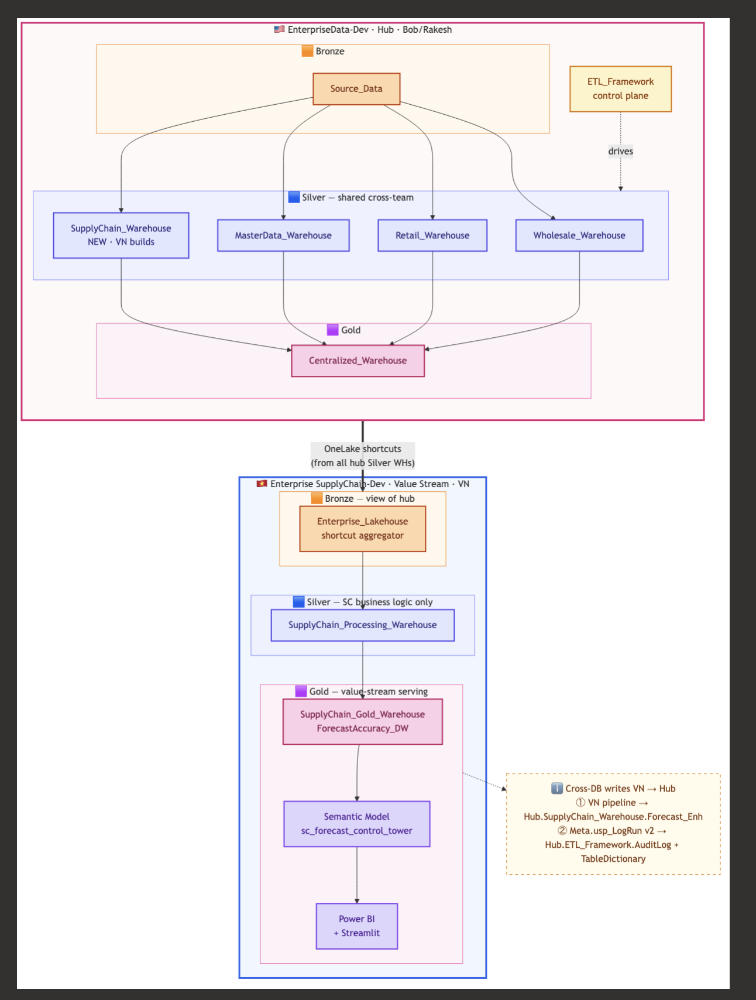

# Data Platform Architecture & Operations (VN SupplyChain) on Microsoft Fabric
*(Detailed version — clear workflow/story, “email-ready” in the sense that you can attach this file as-is.)*

Evidence snapshot date for the compare section: **2026-06-17 (ICT)** *(based on the Enterprise evidence pack scan 2026-05-10 + VN inventory/ops snapshot 2026-06-16)*.

Document goals:
- Written for readers who are **not Data Engineers**, but still need to understand “how the system runs” to make decisions.
- Presented as an end-to-end operational story with a clear flow.
- Compare **end-to-end operations** between two patterns: **VN Control Plane** vs **Enterprise ETL Framework**.
- Make the “alignment / adoption” options explicit, including a “forced adoption of the Enterprise ETL Framework” scenario.

> Tone: neutral. Not “which is better”. Only operational reality + choices/trade-offs.

---

## Table of Contents (end-to-end flow)

0) How to read quickly (2 minutes)  
1) Executive summary (copy into email)  
2) Architecture overview (non-DE friendly)  
3) Day-in-the-life: how a daily run works  
4) Control Plane deep dive: capabilities, meaning, setup, and “why”  
5) Compare end-to-end operations: VN Control Plane vs Enterprise ETL Framework  
6) Concerns & decision questions (maximize utilize: TableDictionary + working/swap) + forced-adopt scenario  
7) Operations & monitoring: ops questions → ops answers (SQL templates)  
8) Alignment / adoption options (for stakeholders to choose)  
9) Forced adoption: what Enterprise ETL framework has vs VN runtime controls  
10) Final decisions to confirm (so you can decide after reading)  
Appendix: onboarding templates (VN vs Enterprise)

## 0) How to read quickly (2 minutes)

If you only have 5 minutes:
1) Read **§1 (Executive summary)**
2) Read **§5 (End-to-end compare)**
3) Read **§8 (Options)** + **§10 (Decisions)**

If you want to understand “why the system can run this way”:
- Read **§2–§4** (architecture + day-in-the-life + feature deep dive)
- Open the toggles in the **Appendix** for practical templates.

---

## 1) Executive summary (copy into email)

**1) What are we operating today?**  
A **value-stream data platform** on Fabric for Supply Chain: transforms in **Processing (Silver)**, publishes in **Gold**, and serves BI via **Direct Lake semantic/report**.

**2) Where is the “operational brain”?**  
In the **Control Plane** (metadata-driven): a registry decides “what to run, when, and in what order”, and the logs answer “what is slow / where it failed”.

**3) Why this architecture?**  
To reduce “one pipeline/proc per table” into “register metadata → engine runs”, while having:
- dependency-safe execution (waves)
- asset-level due gate (smart scheduling)
- run-level observability (status/duration/rows/error)
- (optional) DQ + lineage hooks

**4) What is different about the Enterprise ETL Framework (US)?**  
The Enterprise pattern (TableDictionary + AuditLog + working/swap publish) is optimized for:
- an “enterprise-facing dictionary”: a single place others can read and understand tables
- publish semantics `_Wrk → _LOAD → swap`: consumers do not see partial state

**5) What must be decided to align?**  
Three decisions that unlock execution:
1) Is TableDictionary satisfied by an adapter/export, or is physical sync required?
2) Is working/swap required, and should it apply to Silver, Gold, or both?
3) If the Enterprise framework is forced-adopted, do we need to bring VN runtime controls (due gate/waves/DQ/lineage/runlog), or is it acceptable to drop some?

---

## 2) Architecture overview (non-DE friendly)

### 2.1 Two workspaces and their roles

- **Enterprise (US / EnterpriseData-Dev)**: governance-first.
  - Central ETL framework.
  - TableDictionary/AuditLog act as the “enterprise control surface”.
- **Value stream (VN / Enterprise SupplyChain-Dev)**: runtime-first.
  - Control plane (registry + logs + dependency waves).
  - An active serving layer (Gold + semantic/report), therefore it owns the “consumer contract”.

ASCII overview:

```text
             (Enterprise - US) EnterpriseData-Dev
  Source_Data (Bronze)  + Domain Warehouses (Curated)
          |                       |
          |                 ETL_Framework
          |           (TableDictionary + AuditLog
          |             + working/swap pattern)
          |
          +---- OneLake shortcuts / shared surfaces ----+
                                                       |
                 (Value Stream - VN) Enterprise SupplyChain-Dev
         Processing Warehouse (Silver + Meta/Control Plane)
                          |
                     Gold Warehouse
                          |
                  Direct Lake Semantic + Report
```

### 2.2 Data Plane vs Control Plane (the core idea)

- **Data Plane**: the actual data tables (Silver/Gold) consumed by downstream users.
- **Control Plane**: metadata + logs + rules that decide how the data plane is produced and operated.

One sentence to remember: **Data Plane is “what the system produces”, Control Plane is “how the system decides to produce it”.**

### 2.3 Five architecture principles

1) **Metadata-driven**: the registry drives runtime; avoid hard-coding table lists in pipelines.
2) **Dependency-aware**: do not publish children before parents; enable parallelism with correctness (waves).
3) **Schedule-aware**: decide “due” at the asset/table level.
4) **Observable by default**: every run logs status/duration/rows/error (machine-readable).
5) **Serving-first contract**: Gold + semantic is the consumer contract → schema/naming stability matters.

### 2.4 Visual references (embedded)

**(1) Cross-workspace overview (Enterprise ↔ Value stream)**



**(2) Main architecture**


**(3) Control plane overview**



**(4) Control plane detail**



---

## 3) Day-in-the-life: “How a daily run works”

### 3.0 Pipeline → Control Plane (from the outside)

- [Verified] `pl_sc_master` is the master pipeline (daily schedule 02:00 ICT) → calls `pl_sc_mart` per `project` in the registry → runs Bronze/Silver/Gold driven by metadata.
- The “Control Plane” lives in metadata + procedures (registry, wave planner, generic loader, run logs) — the pipeline is the executor.

### 3.1 Day-in-the-life (operational narrative)

1) **Pick work**: read the registry to identify which assets are “due”.
2) **Plan order**: compute dependencies and split into waves (wave 0 → 1 → 2…).
3) **Execute**: run per wave; within a wave, run in parallel only where dependency-safe.
4) **Log**: each asset run records status/duration/rows/error for triage.
5) **Controls (optional)**: run DQ/reconciliation, record PASS/FAIL, and optionally block publish depending on mode.
6) **Publish**: publish to Gold (and/or curated outputs).
7) **Serve**: semantic/report consumes Gold; if a drift exists, this is where incidents surface fast.

### 3.2 Why “waves + due gate” matter (stakeholder-friendly)

- **Waves**: not only “faster”, but “correct order with safe parallelism”, reducing blast radius on failure.
- **Due gate**: run only what is due, reducing unnecessary runs and capacity spikes.

---

## 4) Control Plane deep dive: capabilities & “why”

This section explains what the Control Plane is and why it helps operations, capability by capability.

### 4.1 Registry (AssetRegistry) — “register to run”

Core idea: instead of hard-coding “which tables to run” in a pipeline/proc, the team **registers metadata** per asset. Runtime reads the registry to decide:

- what to run (asset list)
- in what order (dependency graph)
- when to run (schedule/due)
- how to run (load_type/pattern)

Why this scales:
- As asset count grows, registry-driven prevents “pipeline/proc explosion”.
- When the source/refresh rules change, updating the registry can be enough (no pipeline change).

<details>
  <summary><b>Example: onboarding one new DomainSilver table</b></summary>

  Use case: add `InventoryHistory_Enh.SupplierLeadTime`.

  “Registering” means:
  - create a view `InventoryHistory_Enh.v_SupplierLeadTime`
  - insert a row into `Meta.AssetRegistry` with `asset_id='InventoryHistory_Enh.SupplierLeadTime'`
  - one-table test via `Meta.usp_GenericLoad`
  - only then flip `is_active=1` so the pipeline auto-picks it up

</details>

<details>
  <summary><b>Setup (copy/paste) — minimal registry row</b></summary>

```sql
DECLARE @ws VARCHAR(128) = 'c8d9fc83-18b6-4e1d-8264-0b49eed36fe0';
DECLARE @wh_proc VARCHAR(128) = 'SupplyChain_Processing_Warehouse';

INSERT INTO Meta.AssetRegistry (
    asset_id, project, canonical_layer,
    physical_workspace, physical_item, physical_schema, physical_object,
    legacy_view_name, load_type, primary_key,
    source_objects, depends_on,
    frequency, cron_expression, is_active, access_mode
) VALUES (
    '<Schema>.<TableName>',
    '<project>',
    '<ReferenceMaster|DomainSilver|Gold>',
    @ws,
    @wh_proc,
    '<Schema>',
    '<TableName>',
    '<Schema>.v_<TableName>',
    '<overwrite|incremental|upsert|datekey|daterange|identity|cdc|scd2>',
    '<pk1,pk2,...>',
    '["<UpstreamObject1>","<UpstreamObject2>"]',
    NULL,
    '<daily|monthly|...>',
    '<cron>',
    0,
    '<WarehouseTransform|GoldPublish|...>'
);
```

Start with `is_active=0` for safety and only flip to `1` once the one-table test is green.

</details>

### 4.2 One generic SP with multiple load patterns — “engine by metadata”

Core idea: instead of many stored procedures per table, we use **one engine** (`Meta.usp_GenericLoad`) and route by `load_type`/metadata.

Why stakeholders care:
- A single change in load logic/observability/security applies consistently across all assets.
- When scaling to 50/100/500 tables, we avoid a “proc forest”.

Operational trade-off:
- Dynamic SQL + dispatch logic is harder to debug if logs are weak.
- Therefore the engine must ship with RunLog/AuditLog, and strict metadata inputs (PK/watermark/date key).

<details>
  <summary><b>Example: three common load types (business-language)</b></summary>

  - `overwrite`: rebuild the target table from the view each run (fits small/medium tables or views already scoped to the correct snapshot).
  - `incremental`: load only new rows by `watermark_column` (fits large facts).
  - `datekey` / `daterange`: reload by day/window to handle late-arriving data.

</details>

<details>
  <summary><b>Setup (copy/paste) — one-table test + verify logs</b></summary>

```sql
-- 1) Smoke-test the view
SELECT TOP 100 * FROM <Schema>.v_<TableName>;
SELECT COUNT(*) AS row_count FROM <Schema>.v_<TableName>;

-- 2) Run one-table materialization
EXEC Meta.usp_GenericLoad
    @target_schema = '<Schema>',
    @target_table  = '<TableName>';

-- 3) Verify physical + RunLog
SELECT COUNT(*) AS physical_row_count
FROM <Schema>.<TableName>;

SELECT TOP 50 *
FROM Meta.RunLog
WHERE asset_id = '<Schema>.<TableName>'
ORDER BY start_time_utc DESC;
```

</details>

### 4.3 Waves (DAG runtime) — “correct order with safe parallelism”

Core idea: table dependencies are operational reality. If we run out of order, we fail or produce incorrect outputs.

Waves solve “correct order” while still using concurrency:
- Build a DAG from `depends_on`
- Split into waves: Wave 0 (no dependencies), Wave 1 (depends on Wave 0), …
- Within a wave, assets run in parallel (batch=8) because they are dependency-independent

<details>
  <summary><b>Example (as a graph)</b></summary>

```text
Wave 0:  DimCalendar, DimItem
Wave 1:  FactSales (depends_on DimCalendar, DimItem)
Wave 2:  GoldKPI (depends_on FactSales)
```

If `FactSales` fails in Wave 1, Wave 2 will not run → reduces blast radius and avoids publishing incomplete data.

</details>

<details>
  <summary><b>Setup (copy/paste) — recompute waves + inspect wave assignment</b></summary>

```sql
EXEC Meta.usp_ComputeSilverWaves;

SELECT *
FROM Meta.SilverDagWaveRuntime
WHERE project = '<project>'
ORDER BY wave_number, asset_id;
```

</details>

### 4.4 Due gate / smart scheduling — “run only what is due”

Core idea: schedule should be asset/table-level, not only pipeline-level.

Therefore the control plane stores:
- `cron_expression` (when it should run)
- `next_run_time` (computed so the pipeline can filter “due now”)

Operational benefits:
- Avoid “full refresh every day” when monthly/weekly assets exist.
- Focus compute on what is due → stable runtime/cost.
- Enables table-level SLA management.

Current status:
- [Verified] due-filter is proven in Bronze/REF and Gold.
- [Verified] Silver is currently all-daily; if Silver becomes mixed-frequency, due-filter becomes a requirement.

<details>
  <summary><b>Setup (copy/paste) — query “what is due now?”</b></summary>

```sql
SELECT TOP 200
    r.project, r.asset_id, r.cron_expression, r.next_run_time, r.last_load_date
FROM Meta.AssetRegistry r
WHERE r.is_active = 1
  AND (r.next_run_time IS NULL OR r.next_run_time <= GETUTCDATE())
ORDER BY r.project, r.next_run_time, r.asset_id;
```

</details>

### 4.5 Observability (RunLog/AuditLog/UpdateLog) — “answer ops questions”

Without solid logs, operations get stuck at:
- “pipeline failed” but nobody knows which table failed
- “pipeline is slow” but nobody knows which table is the bottleneck

Run-level logs enable machine-readable answers:
- status (running/success/failed)
- duration (start/end timestamps)
- rows_loaded (detect anomalies)
- error_message (fast triage)

<details>
  <summary><b>Example: top slowest assets (last 7 days)</b></summary>

```sql
SELECT TOP 30
    rl.asset_id,
    rl.status,
    rl.load_type,
    rl.start_time_utc,
    rl.end_time_utc,
    DATEDIFF(SECOND, rl.start_time_utc, rl.end_time_utc) AS duration_sec,
    rl.rows_loaded,
    LEFT(rl.error_message, 200) AS error_preview
FROM Meta.RunLog rl
WHERE rl.start_time_utc >= DATEADD(DAY, -7, GETUTCDATE())
  AND rl.end_time_utc IS NOT NULL
ORDER BY duration_sec DESC;
```

</details>

### 4.6 Data Quality (DQ) — “rules + modes”

Having DQ is not enough — what matters is how it is used:

- **DQ as alert**: detect issues and send alerts, but still publish.
- **DQ as gate**: rules have mode/severity; CRITICAL failures can block publish to prevent consumers using bad data.

To do DQ as gate, we need three pieces:
1) rules registry (definition/target/severity)
2) results store (PASS/FAIL per run)
3) gate policy (Off/WarnOnly/CriticalStops…)

<details>
  <summary><b>Setup (copy/paste) — add one minimal rule</b></summary>

```sql
INSERT INTO Meta.DQRule (
    rule_name, target_schema, target_table, layer,
    check_type, column_name, severity, threshold, is_active
) VALUES
('<rule name>', '<Schema>', '<TableName>', '<DomainSilver|ReferenceMaster|Gold>',
 'completeness', '<ColumnName>', 'CRITICAL', 100.0, 1);

-- Run a single check (id depends on your insert method)
EXEC Meta.usp_CheckDqSingle @rule_id = <new_rule_id>;
```

</details>

### 4.7 Lineage (direct + semantic) — “what does this table read from?”

We treat lineage as two layers:

- **Direct lineage** (data movement): this table/view reads from which sources → transforms → produces which targets.
- **Semantic lineage** (serving contract): when BI serving exists, which measures/visuals/reports are affected by a table change.

Why this matters to an Enterprise team:
- Faster blast-radius analysis for schema changes/drift.
- Faster incident response for downstream failures.

<details>
  <summary><b>Setup (copy/paste) — build & query lineage edges</b></summary>

```sql
EXEC Meta.usp_BuildLineage;

SELECT source_asset, target_asset, edge_type, transform_type
FROM Meta.LineageEdge
WHERE target_asset = '<Schema>.<TableName>';
```

</details>

### 4.8 “Why” FAQ (common questions)

1) Why not “one pipeline per table”?  
→ As we scale, we get pipeline/proc explosion and drift; registry-driven keeps one runtime engine.

2) Why do we need waves?  
→ To keep dependency correctness while still running in parallel (not everything sequential).

3) Why do we need a due gate?  
→ To avoid unnecessary refresh and keep runtime/cost stable as assets grow.

4) Why a separate RunLog vs just text AuditLog?  
→ To query/aggregate machine-readable duration/rows/errors and export monitoring cleanly.

5) Why DQ needs “modes”?  
→ Stakeholders need to distinguish “warn-only” vs “block publish”.

6) Why lineage if TableDictionary already exists?  
→ TableDictionary is great for governance, but lineage graph + semantic edges speed up serving/debug.

---

## 5) Compare end-to-end operations: VN Control Plane vs Enterprise ETL Framework

> Compare is to understand operational capabilities and alignment gaps, not to score “better vs worse”.

Shared foundations:
- Both are **metadata-driven** (registry/dictionary drives runtime).
- Both treat **audit/logging** as part of the control surface.
- Both have **publish semantics** to reduce partial-state risk (Enterprise standardizes strongly via working/swap; VN can adopt by scope).

Different focus:
- Enterprise prioritizes **enterprise-facing governance** (TableDictionary posture + audit trails).
- VN prioritizes **runtime controls** (due gate + waves + run-level metrics + DQ modes + lineage hooks) because serving is active.

### 5.1 Compare across eight operational areas

1) Workspace surface & serving burden  
2) Data contracts  
3) Orchestration  
4) Scheduling & gating  
5) Publish semantics  
6) Observability/Audit  
7) Controls (DQ/Reconciliation)  
8) Lineage  

### 5.2 Workspace surface & serving burden

- VN: [Verified] semantic/report active → higher serving ops burden (schema stability, Direct Lake failures, binding drift).
- Enterprise: [Need-verify] the Enterprise evidence pack focuses on ETL framework + domain warehouses; serving footprint in DEV snapshot is not proven comparable to VN.

Plain-English explanation:
- With active semantic/report, the “data contract” is not just the table schema; it includes relationships/measures/visual expectations. Small upstream drift can cause user-facing incidents.
- Therefore serving adds responsibilities: compatibility, refresh strategy, and change management.

**Implication:** if Enterprise productizes BI more heavily, serving ops will grow (this is a natural cost of serving layers).

### 5.3 Data contracts (what consumers “trust”)

- VN: [Verified] Gold physical tables + Direct Lake semantic model are the contract.
- Enterprise: [Verified] curated domain tables + TableDictionary are the governance contract.

Plain-English explanation:
- Enterprise contract is “enterprise metadata + curated tables”: anyone can read TableDictionary to understand table/keys/refresh/source mapping.
- VN contract is “serving correctness”: Gold tables + semantic model are what reports/consumers directly touch.

**Implication:** when schema changes, decide where backward-compatibility lives (view compatibility, table compatibility, semantic compatibility).

### 5.4 Orchestration (who decides what runs)

- VN: [Verified] registry-driven, project-aware, dependency-aware (waves).
- Enterprise: [Verified] dictionary/mapping-driven, wrapper/loop style; per-table refresh via EXEC calls.

**Implication:**
- VN onboarding is often “register metadata” + engine runs.
- Enterprise onboarding is often “add TableDictionary row” + “add EXEC into wrapper/mapping”.

Example (one-table onboarding):
- Enterprise: domain team creates `_Wrk` view + registers TableDictionary + adds to a sequential wrapper refresh.
- VN: create view + register AssetRegistry (`is_active=0`) + one-table test + flip `is_active=1` (pipeline auto-picks up).

### 5.5 Scheduling & gating

- VN: [Verified] asset-level due gate is proven in Bronze/REF + Gold; Silver is currently all-daily.
- Enterprise: [Verified] pipeline-level schedule exists and TableDictionary has `RefreshRate`/`Modified` for SLA tracking; [Verified] no “smart skip” by refresh rate is observed (wrappers refresh fully).

**Implication:** if the enterprise requirement is “run only what is due”, Enterprise needs asset-level schedule state + due-filter.

### 5.6 Publish semantics (do consumers see partial state?)

- Enterprise: [Verified] working/swap `_Wrk → _LOAD → swap/rename`.
- VN: [Likely] can adopt working/swap selectively for consumer experience, but needs explicit policy.

Plain-English explanation:
- working/swap reduces the risk that consumers read a table mid-load (partial state).
- If VN adopts it, we must decide scope + policy: which tables are mandatory, who can swap, and how rollback works.

### 5.7 Observability/Audit

- VN: [Verified] run-level machine-readable logs (status/duration/rows/error per asset).
- Enterprise: [Verified] AuditLog trail + UpdateLog; [Likely] duration inferred by Start/Complete pairing; [Need-verify] pairing is 100% reliable without correlation id.

**Implication:** if enterprise needs “100% accurate duration analytics”, we need correlation rules/run id.

### 5.8 Controls (DQ / reconciliation / guardrails)

- VN: [Verified] DQ registry/results exist (Meta surface) and can support gate modes.
- Enterprise: [Verified] reconciliation and “check + alert” patterns exist (e.g., pipeline reconciliation + TableDictionary AuditMode/Audit_TableName), but [Need-verify] a full “rules registry + gate modes” subsystem at the asset level.

**Implication:** if DQ gate state + modes are mandatory, Enterprise needs a DQ registry + run log + hook points.

### 5.9 Lineage

- VN: [Verified] lineage surface built from metadata/registry + semantic edges when serving exists.
- Enterprise: [Verified] TableDictionary holds table-level source references; [Need-verify] a lineage graph module (LineageEdge table + build proc) comparable to VN.

Plain-English explanation:
- TableDictionary captures “description + mapping”, but a lineage graph answers “if we change table A, what downstream is impacted?” quickly.

---

## 6) Concerns & decision questions (maximize utilize) + forced-adopt scenario

### 6.1 TableDictionary — what level is needed for “enterprise tooling reuse”?

- Concern: an adapter/export provides posture visibility, but might miss strict schema/ownership rules.
- Decision question: does enterprise require **physical sync** (write into Enterprise TableDictionary) or is **export/adapter** (publish a mapping table/view) enough?

### 6.2 Working/swap publish — scope and ops cost

- [Verified] Enterprise pattern uses `_Wrk` views + `_LOAD` table + rename (swap) to prevent partial state.
- Concern: if VN adopts 100% across all layers, ops complexity increases (swap/rename/drop policy, permissions, audit).
- Decision question: is working/swap mandatory for **Gold only**, or **Silver+Gold**?

### 6.3 Forced adoption of the Enterprise ETL Framework: how to bring VN runtime controls into ETL_Framework

Instead of framing as “who must accept missing capabilities”, a more actionable framing is:

> If the enterprise requires value streams to run on the Enterprise ETL framework, then to avoid operational downgrade, how do we **bring VN runtime controls** into `ETL_Framework` (modules, placement, and rollout sequence)?

Capabilities that VN typically needs when serving is active:
- dependency waves (DAG runtime / parallel batch)
- due gate (asset-level cron + next_run_time filter)
- run-level machine-readable metrics (rows/duration/error per asset)
- DQ rules registry + gate modes (WarnOnly/CriticalStops)
- lineage graph (LineageEdge + build) + semantic edges when BI serving exists

<details>
  <summary><b>How to apply into ETL_Framework (conceptual module mapping)</b></summary>

  The idea is to keep the Enterprise strengths (TableDictionary posture + working/swap), then add runtime modules without breaking governance:

  1) <b>Schedule Gate module</b>  
     - Add schedule state (cron/next_run_time) at the asset level (new table or extension view).  
     - Orchestrator filters “due now” before refresh.

  2) <b>Dependency + Waves module</b>  
     - Store dependency edges (A depends_on B) → compute wave runtime.  
     - Replace sequential wrapper with a “waves executor”: parallel within a wave, sequential between waves.

  3) <b>RunLog module</b>  
     - Keep AuditLog as a trail, but add a machine-readable RunLog (rows/duration/error per asset) for accurate analytics/triage.

  4) <b>DQ module (rules + modes)</b>  
     - Keep existing reconciliation/alerts, but add a rules registry + gate modes to block publish on CRITICAL failures if required.

  5) <b>Lineage module</b>  
     - Keep source reference in TableDictionary; add a LineageEdge graph + build job for fast blast-radius analysis.

  A typical safe rollout order: RunLog → Due gate → Waves → DQ gate → Lineage graph.

</details>

Capability checklist (for fast alignment conversations):

| Capability | VN Control Plane | Enterprise ETL Framework | Notes |
|---|---|---|---|
| Dictionary/metadata contract | [Verified] yes (Meta + TableDictionary compat) | [Verified] yes (TableDictionary 65 cols) | Enterprise governance-first |
| Working/swap publish semantics | [Likely] adopt by scope | [Verified] yes (`_Wrk` views + `_LOAD` + rename) | Enterprise standardizes strongly |
| Smart schedule / due gate | [Verified] yes (BRZ/REF + Gold due-filter) | [Verified] no “smart skip” observed | Enterprise has `RefreshRate`/`Modified` for SLA tracking |
| Dependency waves (DAG runtime) | [Verified] yes (waves + parallel batch) | [Verified] sequential wrapper refresh | Enterprise dependency is mostly manual ordering in proc body |
| Run-level machine-readable metrics | [Verified] yes (rows/duration/error per asset) | [Verified] AuditLog trail + UpdateLog; [Need-verify] 100% duration pairing | Correlation rules/run-id may be needed |
| DQ rules + gate modes | [Verified] subsystem intent (rules/results/modes) | [Verified] check+alert exists; [Need-verify] gate modes | “Alert” vs “Gate” is different |
| Lineage graph + semantic edges | [Verified] yes (metadata/registry + serving) | [Verified] source reference exists; [Need-verify] lineage graph module | Serving footprint differs |
| One generic engine with multiple load patterns | [Verified] yes (8 load patterns via `load_type`) | [Verified] no (35 procs/10 families + UpdateMethod) | Debugability vs maintainability trade-off |

---

## 7) Operations & monitoring: ops questions → ops answers

### 7.1 Five standard ops questions

1) What is the system running right now?
2) What is the slowest part?
3) What failed, and why?
4) What is due now?
5) What does this table read from?

### 7.2 How each pattern answers them

**VN (registry + run logs):**
- Strong answers for #2/#3/#4 via due gate + run-level metrics.

**Enterprise (TableDictionary + AuditLog + working/swap):**
- Strong answers for #5 via enterprise dictionary posture.
- “No partial state” publish via working/swap.
- #2/#3 can be inferred from AuditLog; for 100% accuracy, correlation rules/run-id must be defined.

### 7.3 SQL templates (optional)

```sql
-- Top runs by duration (last 7 days)
SELECT TOP 30
    rl.asset_id,
    rl.status,
    rl.load_type,
    rl.start_time_utc,
    rl.end_time_utc,
    DATEDIFF(SECOND, rl.start_time_utc, rl.end_time_utc) AS duration_sec,
    rl.rows_loaded,
    LEFT(rl.error_message, 200) AS error_preview
FROM Meta.RunLog rl
WHERE rl.start_time_utc >= DATEADD(DAY, -7, GETUTCDATE())
  AND rl.end_time_utc IS NOT NULL
ORDER BY duration_sec DESC;

-- Recent failures
SELECT TOP 50
    rl.asset_id, rl.start_time_utc, rl.end_time_utc, rl.status, rl.rows_loaded, rl.error_message
FROM Meta.RunLog rl
WHERE rl.status <> 'success'
ORDER BY rl.start_time_utc DESC;

-- “What is due now?”
SELECT TOP 200
    r.project, r.asset_id, r.cron_expression, r.next_run_time, r.last_load_date
FROM Meta.AssetRegistry r
WHERE r.is_active = 1
  AND (r.next_run_time IS NULL OR r.next_run_time <= GETUTCDATE())
ORDER BY r.project, r.next_run_time, r.asset_id;
```

---

## 8) Alignment / adoption options (for stakeholders to choose)

### Option A — Keep VN runtime engine, add an “enterprise-facing visibility layer”

Keep registry/waves/due gate/run logs/DQ/lineage; add a presentation layer so stakeholders can read it “like TableDictionary/Audit”.

- Pros: no runtime downgrade; fast rollout.
- Cons: must confirm output contract (required columns, strict schema).
- Trade-off: more modeling effort, minimal runtime regression risk.

### Option B — Adopt Enterprise working/swap publish pattern (choose scope)

Adopt `_Wrk → _LOAD → swap` for key publishes (Silver/Gold/both).

- Pros: consumers do not see partial state.
- Cons: needs swap/rename/drop policy; must decide scope.
- Trade-off: higher ops complexity, better consumer experience.

### Option C — Physical TableDictionary sync “exactly like Enterprise”

Sync/export as a physical table that matches Enterprise schema requirements.

- Pros: Enterprise monitoring/tooling can be reused 1:1.
- Cons: drift/maintenance risk; requires approval/permissions.
- Trade-off: highest compatibility, highest ops cost.

---

## 9) Forced adoption: what Enterprise ETL framework has vs VN runtime controls

### 9.1 Enterprise does well already

- [Verified] enterprise-facing dictionary posture (TableDictionary/AuditLog)
- [Verified] working/swap publish (consumers do not see partial state)

### 9.2 Enterprise can do it, but measurement must be defined

- [Likely] “slowest table/proc” can be inferred by pairing AuditLog Start/Complete
- [Need-verify] if 100% correctness is required in all cases (retries/concurrency/nested calls), correlation id or strict pairing rules are needed

### 9.3 Enterprise has hooks, but needs explicit modules to match VN runtime controls

If we must avoid operational downgrade, Enterprise needs modules for:
- asset-level due gate (next_run_time/cron per asset)
- dependency waves (DAG runtime)
- DQ gate state + modes (WarnOnly/CriticalStops)
- lineage state table + build proc
- run-level machine-readable metrics (rows_loaded/error per asset)

### 9.4 Minimal upgrade checklist (if Enterprise must reach VN capability)

1) Schedule gate: add schedule-state + `is_due` + orchestrator due-filter  
2) Waves: add dependency edges + wave runtime + wave executor  
3) DQ: add DQ registry + DQ run log + hook points + gate modes  
4) Lineage: add LineageEdge + build procedure from mapping/metadata  
5) RunLog: if AuditLog is only a trail, add machine-readable RunLog for rows/duration/error per asset  

---

## 10) Final decisions to confirm (so you can decide after reading)

1) TableDictionary: is adapter/export sufficient, or is physical sync required? How strict is schema parity?  
2) Working/swap: mandatory or optional? Apply to Silver, Gold, or both?  
3) Forced adoption: must we bring VN runtime controls (due gate/waves/DQ/lineage/runlog) or can we drop some?  
4) Ops metrics level: table-level, proc-level, or pipeline-level? Is correlation id mandatory?  
5) Ownership: who owns added modules (Enterprise team vs value-stream team), and where should they live (ETL framework vs domain warehouse)?  

---

## Appendix (optional)

<details>
  <summary><b>Appendix A: Onboard 1 new table using the VN pattern (template)</b></summary>

  Goal: add a new table/asset without “one pipeline per table”.

  1) Confirm the contract: target schema/table, grain, primary key, refresh frequency.
  2) Create the source view / transform logic (if needed).
  3) Register metadata in the registry (asset_id, project, layer, load_type, source mapping, depends_on, schedule).
  4) (Optional) add DQ rules and reconciliation rules.
  5) Run once manually and verify logs (status/duration/rows/error) + verify consumer contract (Gold/semantic if applicable).

</details>

<details>
  <summary><b>Appendix B: Onboard 1 curated table using the Enterprise pattern (template)</b></summary>

  Goal: add a curated table using “dictionary-first + working/swap publish”.

  1) Write a view in the working schema (`*_Wrk.v_*`).
  2) Insert/Update a row in TableDictionary (update method, refresh rate, source mapping, keys).
  3) Add an EXEC call to the wrapper proc/mapping loop to refresh.
  4) Verify AuditLog + TableDictionary.Modified/UpdateLog.

</details>

<details>
  <summary><b>Appendix C: Detailed setup (copy/paste) — View → Registry → DAG/Lineage → One-table test → Activate</b></summary>

  Purpose: provide end-to-end setup detail from request to pipeline auto-pickup.

  <b>0) Mental model</b>

```text
DA request
  -> define source + target + grain
  -> create T-SQL view
  -> insert Meta.AssetRegistry row (is_active=0)
  -> recompute Silver DAG / lineage
  -> run one-table test
  -> flip is_active=1 (pipeline auto-picks up)
```

  <b>1) Smoke-test the view</b>

```sql
SELECT TOP 100 * FROM <Schema>.v_<TableName>;
SELECT COUNT(*) AS row_count FROM <Schema>.v_<TableName>;
```

  If you expect unique primary keys:

```sql
SELECT
    COUNT(*) AS row_count,
    COUNT(DISTINCT CONCAT(<pk_col1>, '|', <pk_col2>, '|', <pk_col3>)) AS distinct_key_count
FROM <Schema>.v_<TableName>;
```

  <b>2) Insert a registry row (DomainSilver example)</b>

```sql
DECLARE @ws VARCHAR(128) = 'c8d9fc83-18b6-4e1d-8264-0b49eed36fe0';
DECLARE @wh_proc VARCHAR(128) = 'SupplyChain_Processing_Warehouse';

INSERT INTO Meta.AssetRegistry (
    asset_id, project, canonical_layer,
    physical_workspace, physical_item, physical_schema, physical_object,
    legacy_view_name, load_type, primary_key,
    source_objects, depends_on,
    frequency, cron_expression, is_active, access_mode
) VALUES (
    '<Schema>.<TableName>',
    '<project>',
    'DomainSilver',
    @ws,
    @wh_proc,
    '<Schema>',
    '<TableName>',
    '<Schema>.v_<TableName>',
    '<load_type>',
    '<pk1,pk2,...>',
    '["<UpstreamObject1>","<UpstreamObject2>"]',
    NULL,
    '<daily|monthly|...>',
    '<cron>',
    0,
    'WarehouseTransform'
);
```

  <b>3) Recompute Silver DAG (DomainSilver)</b>

```sql
EXEC Meta.usp_ComputeSilverWaves;

SELECT *
FROM Meta.SilverDagWaveRuntime
WHERE asset_id = '<Schema>.<TableName>';
```

  <b>4) Build lineage</b>

```sql
EXEC Meta.usp_BuildLineage;

SELECT source_asset, target_asset, edge_type, transform_type
FROM Meta.LineageEdge
WHERE target_asset = '<Schema>.<TableName>';
```

  <b>5) One-table materialization test</b>

ReferenceMaster / DomainSilver (Processing Warehouse):

```sql
EXEC Meta.usp_GenericLoad
    @target_schema = '<Schema>',
    @target_table  = '<TableName>';
```

Verify:

```sql
SELECT COUNT(*) AS physical_row_count
FROM <Schema>.<TableName>;

SELECT TOP 50 *
FROM Meta.RunLog
WHERE asset_id = '<Schema>.<TableName>'
ORDER BY start_time_utc DESC;
```

  <b>6) DQ rules (optional, recommended)</b>

```sql
INSERT INTO Meta.DQRule (
    rule_name, target_schema, target_table, layer,
    check_type, column_name, severity, threshold, is_active
) VALUES
('<rule name>', '<Schema>', '<TableName>', '<DomainSilver|ReferenceMaster|Gold>',
 'completeness', '<ColumnName>', 'CRITICAL', 100.0, 1);
```

  <b>7) Activate (pipeline auto pickup)</b>

```sql
UPDATE Meta.AssetRegistry
SET is_active = 1
WHERE asset_id = '<Schema>.<TableName>';

EXEC Meta.usp_ComputeSilverWaves;
EXEC Meta.usp_BuildLineage;
```

  <b>8) Gold note (destructive risk)</b>

  [Verified] Gold publish is described as `pl_sc_gold` running CTAS by registry. If you run CTAS manually, avoid overwriting production-facing tables unless explicitly approved.

</details>

